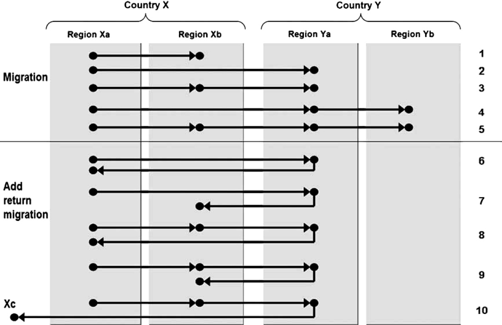

# Marco teórico

El marco teórico se divide en tres apartados. En el primero se revisan las teorías migratorias y su vinculación con las migraciones internas. En el segundo se realiza una breve revisión del concepto de “espacio geográfico” y sus posibles relaciones con el abordaje de las migraciones internas que se propone realizar en la investigación. En el tercer apartado se analizan los fundamentos teóricos de la interacción espacial y los abordajes para su análisis.

## Introducción a las teorías migratorias

Las migraciones internas difieren de la **movilidad residencial** y la **movilidad pendular**. La movilidad residencial implica “mudanzas” de menor jerarquía en términos de la distancia entre la antigua y la nueva residencia, en comparación con la migración. Estos cambios le permitirían a la persona que se muda mantener el mismo trabajo y frecuentar los mismos grupos sociales [@dennett2018]. Por otro lado, la movilidad pendular es aquella que tiene frecuencia diaria o semanal, con el fin de asistir a lugares de trabajo o centros de estudio. A pesar de las anteriores definiciones, es necesario aclarar que la migración interna y la movilidad residencial forman en realidad un continuo, no existiendo un criterio absolutamente claro de demarcación entre ambas [@dennett2018], es decir que la separación de estos dos conceptos es esquiva desde el punto de vista teórico pero puede ser resuelta operativamente. En la misma línea argumental, vale destacar que tanto el concepto de residencia como la unidad espacial que se tome de referencia, alteraran el concepto de migración, y esta característica diferencia a las migraciones de otras variables demográficas: nacimientos y defunciones son fenómenos absolutos en tanto migrar es relativo [@macadar2009].
El estudio de las migraciones en general se divide entre internacional e interna, entre otras varias posibilidades de clasificación (como voluntarias o forzadas, temporales o permanentes, etc.).

El conocimiento convencional deriva en forma automática hacia algunos factores que pueden ser determinantes en el proceso migratorio: diferencias geográficas de ingresos monetarios, empleo y oportunidades de desarrollo personal [@king2012]. Sin embargo la decisión y posibilidad de migrar no se ve relacionada en forma unívoca a estos factores, siendo un fenómeno complejo.

Los inicios de la teorización sobre las migraciones datan de fines del siglo XIX [@dehaas2015]. Hacia los años 1980s, el foco de la producción académica relativa a migraciones comienza a virar del estudio de las migraciones internas a las internacionales, al punto que hoy “migración” refiere en general a “migración internacional”, aún siendo las migraciones internas más importantes si se atiende a la cantidad de personas que involucran ambos fenómenos [@king2010; @king2012].

De Haas et. al. -@dehaas2015 diferencian, siguiendo a @massey1993, entre aquellas teorías orientadas a las causas de la migración y aquellas orientadas a los impactos en las sociedades emisoras o receptoras. Los autores proponen un esquema que permite categorizar los procesos migratorios y las teorías que los abordan, conceptualizando a los movimientos migratorios como el resultado de la interacción entre estructuras macro y micro, en tanto proponen la existencia de meso-estructuras que vinculan las dos anteriormente mencionadas, proveyendo una explicación para la continuidad espacio-temporal de los procesos migratorios.

A su vez, los autores identifican dos paradigmas principales en los cuales agrupar las teorías que dan origen a los procesos migratorios: el **funcionalista** y el **histórico-estructural**. Según el paradigma funcionalista, la sociedad puede ser analizada como un sistema, como la interacción de diferentes partes interdependientes y tendientes al equilibrio. Por otro lado, el paradigma histórico-estructural pone foco en los factores sociales, económicos, culturales e históricos que constriñen y dirigen el comportamiento de los individuos, en formas que generalmente no tienden al equilibrio, sino que refuerzan los desequilibrios preexistentes [@dehaas2015].

### Las primeras contribuciones

 Las “leyes de la migración”, formuladas por Ravenstein en el siglo XIX, se consideran la primera teorización sobre migración y se derivan de sus observaciones de la migración interna [@anderson2011; @king2010]. Analizando fuentes de datos demográficos oficiales de varios países, Ravenstein identificó a algunas generalizaciones empíricas que aún hoy son consideradas relevantes [@arango1985; @gregory2009; @he2003, @okelly2009, @rees2019]. A modo de ejemplo:

- El rol de la distancia como factor de estímulo, o por el contrario como “fricción” (hay más movimientos de corta distancia que de larga distancia).

- Las personas migran para mejorar sus circunstancias económicas, por ende se dirigen a lugares donde haya concentración de oportunidades económicas, en particular hacia las ciudades.

- Las migraciones se aceleran en tanto el movimiento es más fácil, por ejemplo si hay medios de transporte disponibles y las infraestructuras asociadas a los mismos.

- Las mujeres tienden a moverse a distancias más cortas que los hombres, aunque son más propensas a migrar.

- Las migraciones en una dirección generan una corriente migratoria opuesta.

Según Arango -@arango1985, los puntos a resaltar de los aportes de Ravenstein son: la detección empírica de algunas características del proceso migratorio, el predominio del móvil económico, el uso implícito del marco *“push-pull”* y la preferencia otorgada a los factores de atracción (*“pull”*). En cuanto a las omisiones, Arango menciona la ausencia de una referencia a los mecanismos que inician los procesos migratorios (es decir cómo se desencadenan en una primera instancia), la existencia de obstáculos u oportunidades intermedias entre *push* y *pull*, la regionalidad e historicidad de las migraciones y su carácter selectivo. Para el presente trabajo es interesante destacar como Ravenstein ya vislumbraba la incidencia de la distancia como factor de estímulo/desestímulo de los procesos migratorios [@poot2016], anticipándose a los futuros modelos gravitatorios [@rees2019; @okelly2009].

### Teorías dentro del paradigma funcionalista

Podemos considerar a Ravenstein como precursor de los modelos “push-pull”, teoría enmarcada en el paradigma funcionalista. Dichos modelos se inspiran en las leyes de gravedad de Newton, identificando las entidades geográficas de origen y destino de migrantes como objetos relacionados por el flujo de migrantes. La relación estará dada por la masa (por ejemplo, cantidad de población) y los factores de atracción-expulsión.

Los modelos push-pull identifican factores económicos, ambientales y demográficos que se asumen como expulsores de la población de ciertos lugares y atractores hacia otros lugares. Cómo crítica principal se resalta su carácter meramente descriptivo, sin profundizar en el rol e interacciones de los factores determinantes de los flujos y su dificultad para explicar la ocurrencia simultánea de emigración e inmigración [@dehaas2015; @vandergaag2003]. Los modelos push-pull son el origen de los “modelos de interacción espacial”. A pesar de las críticas mencionadas, el abordaje conceptual es afín al presente trabajo, en tanto los espacios emisores y atractores se consideran como entidades en interacción, la cual tiene un componente espacial (aunque no sea el único).

Otro enfoque significativo dentro del paradigma funcionalista es la teoría neoclásica de las migraciones, introducida por Todaro -@todaro1969 para explicar las migraciones rural-urbano en los países en desarrollo, ha tenido gran influencia en el desarrollo de políticas públicas migratorias [@massey1993]. También se basa en la tendencia al equilibrio de las fuerzas sociales y es considerada como la teoría de las migraciones más antigua (excluyendo los aportes de Ravenstein por no conformar una “teoría” propiamente dicha).

Según la teoría neoclásica, la migración sería una parte del desarrollo económico y tendería a equilibrar las diferencias geográficas en la oferta y demanda de mano de obra [@dehaas2015].

A nivel macro la migración es vista como un proceso que optimiza la localización de los factores de producción: hace menos escasa la mano de obra en destino y más escasa en el origen, siguiendo el capital la dirección contraría; ese proceso tenderá a la convergencia de los ingresos entre ambas localidades. En otras palabras, hay un flujo de mano de obra desde los países no desarrollados hacia los desarrollados y un contra-flujo de capital, estimulada por altas tasas de retorno de inversiones, que dará paso al desarrollo en la nación de origen de la migración y concluirá el proceso en la convergencia de ambos estados como países desarrollados [@massey1993]. A nivel micro, el migrante es considerado como un individuo que actúa en forma racional, y que basa la decisión de migrar en un cálculo de costo-beneficio con el objetivo de maximizar sus ingresos.

A modo de críticas, la asunción de que los individuos son actores racionales, que maximizan su utilidad recurriendo a una comparación sistemática del costo y beneficio de migrar o permanecer en el origen, puede considerarse un supuesto demasiado fuerte. En el mismo sentido, parecería demasiado aventurado dar por cierto que los migrantes potenciales manejan perfectamente la información relativa a los salarios y oportunidades de empleo en el país de destino [@dehaas2015]. Vale destacar que a pesar de estas críticas, las formulaciones neoclásicas fueron el sustento intelectual de muchas políticas inmigratorias [@massey1993]. Con respecto al presente trabajo, se puede arriesgar que la oferta de empleo (o de oportunidades económicas en un sentido más amplio) sea un factor relevante en los procesos migratorios internos. Sin embargo, la existencia de un flujo de capital contrario a la corriente migratoria no se desprende como una consecuencia necesaria, por el contrario se esperaría que dichos procesos consoliden desigualdades espaciales preexistentes.

Tanto las teorías basadas en modelos “push-pull” como la neoclásica dan un lugar marginal a la capacidad de agencia de las personas, es decir a su capacidad de actuar con base en intenciones conscientes y tomar decisiones en forma independiente.

### Teorías dentro paradigma histórico-estructural

Las teorías enmarcadas dentro del denominado paradigma “histórico-estructural” surgen entre los años 70s y 80s. En ellas la migración es interpretada como una manifestación de la penetración capitalista y de la existencia de términos comerciales desiguales entre países desarrollados y sub-desarrollados, por lo cual tienden a enfocarse en los reclutamientos masivos de mano de obra por parte de los países desarrollados [@dehaas2015].

Los teóricos dentro de este paradigma critican al abordaje neoclásico aduciendo que la idea de un individuo que elije libremente migrar con el fin de maximizar su ingreso es falaz. Por el contrario, consideran que las personas no tienen libertad de elección, sino que están constreñidas por fuerzas estructurales. Desde esta perspectiva, los cambios producto de la inserción en una economía global y de las transformaciones técnicas (como la mecanización), fuerzan a la gente a migrar. Estos procesos, por ejemplo, privan a las poblaciones rurales de su modo de vida tradicional, siendo desarraigadas de sus tierras ancestrales y pasando a engrosar las filas de proletariado urbano, que conformará la mano de obra barata disponible para el empleo industrial [@dehaas2015]. Por oposición a la visión neoclásica, las migraciones acentúan las diferencias geográficas y el desarrollo desigual, aumentando el desequilibrio en lugar de tender a la convergencia. Estas últimas consideraciones van en sintonía con el abordaje del presente trabajo, entendiendo la migración interna como un proceso que no es necesariamente igualador.

Uno de los abordajes teóricos atribuye las migraciones a la estructura de un mercado mundial en desarrollo y expansión desde el siglo XVI, la **teoría del sistema mundial** [@massey1993], basada en los aportes de Immanuel Wallerstein -@wallerstein1974. Según este abordaje, la penetración en las regiones periféricas de las empresas multinacionales controladas por las economías centrales, aceleró el cambio en el medio rural y desencadenó migraciones rural-urbano, rápida urbanización y crecimiento de la economía informal [@dehaas2015]. El objetivo fue la búsqueda del lucro a partir de conseguir nuevos mercados, fuentes de materias primas, tierras y trabajadores. Es así que la migración es parte del desarrollo del sistema capitalista, ocasionada por las disrupciones que genera en las economías tradicionales: en la medida que la economía capitalista se expande a territorios periféricos, con ella también se expanden los mercados de trabajo, haciendo inevitables los flujos migratorios [@massey1993]. La migración refuerza los efectos de la hegemonía militar y el control del comercio e inversiones para mantener al “tercer mundo” dependiente del “primero”. A su vez identifican un flujo contrario al sentido del migratorio, el flujo del capital.

Más cerca en el tiempo surge la **teoría de la globalización**. Esta emerge en los 90s y tiene como precursores a la teoría de la dependencia y a la del sistema mundial. Entendiendo la globalización como el proceso de consolidación y aceleración de la interconexión mundial en todos los aspectos de la vida social, el incremento de los flujos transfronterizos de todo tipo será un indicador del proceso globalizador, y dentro de esos flujos se encuentran los migratorios [@dehaas2015]. Dicho incremento de flujos se asocia a una “compresión espacio-temporal” causada por la reducción de la fricción de la distancia en los movimientos, es decir la disminución de los costos para movilizar esos flujos (sean capitales, mercancías, información, personas etc.). La reducción de la fricción de la distancia se asocia a los esfuerzos del capital por desterritorializarse [@gregory2009]. Dichos esfuerzos se materializan en mayores y mejores infraestructuras para los medios de transporte, medios de comunicación globales (televisión, telefonía, internet), mercados globales, auge de las finanzas y la logística, entre muchos otros aspectos.

La globalización en su visión política ha estado asociada al discurso neoliberal de los 80s, que implica liberalización de los mercados, privatizaciones y desregulación (el llamado Consenso de Washington), facilitada por el poder ejercido por los organismos multilaterales de crédito, siendo el Banco Mundial y el Fondo Monetario Internacional los más relevantes, instituciones que, junto con la Organización Internacional del Comercio, serán las que impongan el nuevo orden mundial neoliberal a través de sus programas de “ajuste estructural” [@dehaas2015; @peet2009].

Se asocia la globalización a la expansión de las migraciones como consecuencia de las posibilidades abiertas por los medios de transporte y las nuevas tecnologías de la comunicación. Sin embargo esas mismas tecnologías pueden haber potenciado otros procesos, los cuales explicarían que el porcentaje de personas migrantes se mantenga relativamente estable desde los años 50s, procesos como el alcance del comercio, el teletrabajo o el aumento de los movimientos pendulares (“commuting”). Por el contrario, los viajes por trabajo, negocios o turismo no paran de aumentar [^1] [@dehaas2015].

Esto puede estar relacionado con la selectividad de las migraciones, ya que en tanto los migrantes de baja cualificación o que escapan persecución son a menudo rechazados, los migrantes altamente calificados son recibidos, lo que puede hablarnos de una “hipermovilidad” de los ricos en tanto que los pobres permanecen fijos a su territorio.

¿Cómo han influido o influyen fenómenos de escala mundial, como la globalización, en fenómenos de escala nacional, como las migraciones internas?. Las relaciones son múltiples, pero se destacan dos de las principales que atañen a la situación en Uruguay. En primer lugar el flujo de capitales cada vez mayor, no solamente capital financiero, sino en todas las ramas de la actividad económica. En particular en el agro, industria y turismo, la llegada de capitales extranjeros o multinacionales ha tenido impactos que han modificado la geografía económica del país, como ser la generación de demanda de mano de obra en determinados territorios (y la pérdida de puestos de trabajo en otros), con posibles consecuencias relativas a los movimientos internos de población. En segundo lugar, los ya mencionados programas de ajuste estructural tuvieron su correlato local durante la crisis económica del 2002, con consecuencias de todo tipo y posiblemente también en los flujos migratorios.

Otra teoría enmarcada en el paradigma histórico-estructural es la **teoría de los mercados duales**, la cual contribuye al entendimiento de como la demanda de trabajadores inmigrantes altamente calificados y de baja calificación está imbricada estructuralmente en las economías capitalistas modernas, por ende la migración se disocia de un modelo de decisión a nivel micro [@dehaas2015; Massey et al. 1993). El principal defensor de la teoría ha sido Piore, quien destaca que más que factores de expulsión, el rol determinante lo tienen los factores de atracción en los países de destino: una necesidad crónica de mano de obra extranjera [@massey1993].

Para esta teoría la migración internacional es causada por la demanda estructural dentro de las naciones desarrolladas de trabajadores muy calificados y de baja calificación, estos últimos para dedicarse a las manufacturas, líneas de montaje o servicios como limpieza, cocina y cuidados. La demanda de trabajo de baja calificación se asocia a los bajos sueldos y el estatus de las tareas, teniendo como consecuencia que la población nativa no quiera emplearse en ellas. Otro aspecto es el motivacional, ya que muchos inmigrantes estarán dispuestos a realizar las tareas más indeseadas porque no tienen una aspiración de movilidad social ascendente (al menos en sus primeros pasos como migrantes) ni un estatus que mantener, sino que su objetivo es ganar dinero para un fin concreto, que puede ser mejorar el estatus o bienestar en el país de origen, comprar bienes, entre muchas otras posibles motivaciones [@massey1993].

La teoría resalta el rol de la raza y el género, además de los factores institucionales, para consolidar esos mercados duales. La selección de los trabajadores para el mercado primario se basará en el capital humano, pero también en la pertenencia al grupo étnico-racial mayoritario, al género masculino y al estatus migratorio en caso de los migrantes. Por el contrario, los reclutados para el mercado laboral secundario estarán en desventaja con respecto al grupo primario, no solo por su calificación, sino por su género, raza, estatus de minoría o estatus legal irregular [@dehaas2015; @sassen1991; @vegasolis2003]. El mercado de trabajo secundario, consistente de puestos flexibles, precarizados y prescindibles ante los vaivenes de la economía, se vio potenciado por las políticas neoliberales y la desregulación de los mercados laborales, consolidando un sector de trabajadores subalternos en una economía “posfordista” [@harvey1998]. La teoría de los mercados duales permite comprender como el estatus irregular de los migrantes es funcional a los intereses de los empleadores, ya que crean una vulnerabilidad disciplinadora de la fuerza de trabajo [@dehaas2015].

La teoría de los mercados duales se puede relacionar con la globalización y la consolidación de las denominadas “ciudades globales” según el trabajo de Saskia Sassen -@sassen1991. En dichas ciudades la demanda de empleo crecería en sectores de muy alta calificación, como ser los servicios financieros (Nueva York) o la tecnología (San Francisco), y en sectores de baja calificación: aquellos que encarnan el sector servicios consumido por el grupo de trabajadores privilegiados.

La principal crítica a los abordajes histórico-estructurales se asienta en su **negación de la capacidad de agencia de las personas**, ya que los migrantes son descritos como meras víctimas del capitalismo global. En ese sentido se identifica una tensión entre el abordaje neoclásico y las teorías histórico-estructurales, dado que no pareciera realista considerar a los migrantes ni como víctimas pasivas sin capacidad de agencia ni como actores totalmente libres que realizan constantemente cálculos de costo-beneficio para tomar sus decisiones [@dehaas2015].

Otra critica refiere a la concepción un tanto idealizada de las sociedades premodernas, las cuales son consideradas como estáticas y estables, en las cuales la migración era un fenómeno excepcional. En realidad en las sociedades premodernas, por ejemplo en la Europa feudal, la condiciones de vida eran de gran explotación para los estamentos inferiores [@dehaas2015].
Con respecto al presente trabajo, la teoría de los mercados duales podría relacionarse con demandas específicas de mano de obra en determinados sectores, en contratos eventuales, como puede ser la construcción, los servicios al turismo, o el sector agropecuario. Inclusive en las economías informales derivadas de estos sectores en épocas de zafras o temporadas.

### Nuevas teorías migratorias

A partir del 1980 un cuerpo de estudios ha subrayado la diversidad de la migración y la importancia de la agencia de los migrantes describiendo como estos tratan de superponerse a las limitantes estructurales, como ser las restricciones inmigratorias, la exclusión social o el racismo. A su vez toman en cuenta la capacidad de los flujos migratorios para crear estructuras sociales que pueden incidir en la auto-perpetuación de las corrientes migratorias [@dehaas2015].

#### Nueva economía de la migración

La **nueva economía de la migración por trabajo (NELM)** surge como respuesta crítica a las asunciones de la teoría neoclásica [@massey1993]. Stark -@stark1991 argumentó que las decisiones de migrar en los países en desarrollo son más una decisión familiar tomada dentro del hogar que una decisión aislada tomada por un individuo, es decir que el móvil de la migración no sería la maximización del ingreso individual tal cual esgrime la teoría neoclásica, sino que sería un comportamiento orientado a compartir riesgos, diversificando fuentes de ingreso dentro del hogar.

En segundo lugar, la migración de determinados integrantes de un hogar puede redundar en inversiones en las actividades familiares en el lugar de origen, teniendo en cuenta el flujo de capital que significan las remesas. También pueden ser una herramienta para obtención de capital para inversiones en la actividad familiar en el origen, en el entendido de que la disponibilidad de mercados crediticios en el origen es acotada o inaccesible [@massey1993].

En tercer lugar, las migraciones se conceptualizan como respuestas a la pobreza relativa más que a la pobreza absoluta, es decir que el móvil de la migración no solamente podría ser aumentar los ingresos del hogar, sino aumentarlos con respecto a otros hogares [@massey1993].
Es así que la NELM da lugar a la agencia, en tanto las personas no quedan reducidas a meras víctimas del capitalismo global, sino que tienen la capacidad de emprender acciones para mejorar su vida a pesar de las dificultades que tiene que afrontar [@dehaas2015].

Un aspecto a considerar, que relaciona la NELM con las teorías neoclásicas, es el aportado por Massey et. al. -@massey1993 quienes categorizan a ambas como un modelo de decisión micro (individuo vs. hogar), aunque lleguen a conclusiones diferentes en cuanto al origen de la migración internacional. Dichas diferencias se resumen en el siguiente cuadro:

|                                       | T. Neoclásica               | NELM                                |
|---------------------------------------|-----------------------------|-------------------------------------|
| Unidad que toma decisiones            | Individuo                   | Hogar                               |
| Entidad a ser maximizada o minimizada | Ingresos                    | Riesgo                              |
| Asunciones de contexto económico      | Mercados que funcionan bien | Mercados imperfectos o inexistentes |
| Contextualización del ingreso         | Absoluto                    | Relativo a otros grupos             |

Table: Diferencias entre la teoría neoclásica y la NELM, asumiendo la similitud de que ambas son un modelo de decisión a nivel micro [@massey1993]. {#tbl:teorias}

#### Redes y teorías de los sistemas migratorios

Las siguientes teorías hacen énfasis en las meso y micro-estructuras creadas por los migrantes en el proceso migratorio y que permiten la continuidad del flujo en el tiempo y espacio, es decir la perpetuación del flujo migratorio [@dehaas2015].

La **teoría de las redes migratorias** explica como los migrantes establecen y mantienen lazos con otros migrantes y con familiares y amigos en el lugar de origen, y como de estos vínculos pueden emerger redes sociales [@dehaas2015]. Dicha red social puede facilitar futuras migraciones, en tanto operan como un capital social que disminuye el costo de migrar (económico, social, psicológico) y entran en un proceso de feedback o retroalimentación, ya que cuanto más expandida sea la red más se adaptaría al concepto de capital social y cumpliría la función mencionada anteriormente. Los migrantes ya asentados pueden oficiar como puerta de entrada para nuevos migrantes y el desarrollo de comunidades migrantes en el país de destino puede disminuir los costos de migrar, pero también desarrollar una infraestructura económica propia que cumpla esa función (lugares de culto, asociaciones, tiendas, cafés, servicios profesionales, etc.) A su vez, puede dar lugar a una verdadera “industria de la migración” [@dehaas2015].

En lo que refiere a las migraciones internas, la teoría de las redes podría tenes más asidero en países de gran extensión y diversidad, en los cuales una migración interna se puede asimilar a una internacional en ciertos aspectos, por ejemplo en distancias, idioma, cultura y etnia. En cambio, en Uruguay resulta bastante difícil vislumbrar la posibilidad de aplicar dicho marco conceptual para en análisis de migraciones internas.

La **teoría de los sistemas migratorios** se centra en como la migración está intrínsecamente vinculada a otras formas de intercambio, en particular al flujo de bienes, ideas y dinero; y como esto afecta las condiciones en las cuales la migración tiene lugar en una primera instancia, tanto en origen como en destino [@dehaas2015].

El pionero en el desarrollo de esta teoría fue el geógrafo Akin Mabogunje -@mabogunje1970, quien hizo énfasis en la importancia de los mecanismos de feedback, mediante los cuales la información acerca de la recepción de los migrantes y su progreso en la localidad de destino es transmitida al lugar de origen, centrándose en las migraciones rural-urbano dentro de África. Los sistemas migratorios vinculan a las personas, familias y comunidades en el espacio, lo cual alienta migraciones sobre caminos espaciales determinados, y desalienta otros caminos, teniendo como resultado unos intercambios relativamente estables que conforman una estructura geográfica que persiste en el tiempo y espacio [@dehaas2015]. El principal aporte de Mabogunje fue enfocar la atención en la migración como un sistema circular, independiente, progresivamente complejo y auto-modificable [@pryor1981].

La implicación de mayor relevancia en la teoría de los sistemas migratorios es que una forma de intercambio, como el comercio, puede llevar a otras, como el flujo de personas, en ambas direcciones. A su vez los flujos migratorios pueden favorecer otros flujos: comerciales, de capital, viajes y turismo, etc. [@dehaas2015].

Aunque las teorías presentadas son de importancia para comprender el rol de la agencia en la construcción de meso-estructuras que auto-sustentan el proceso migratorio, estas también presentan algunas debilidades. En primer lugar fallan al explicar porque la mayoría de las migraciones pioneras no derivan en la consolidación de redes migratorias y sistemas migratorios. Tampoco hay explicaciones sobre porqué los sistemas se debilitan o se pueden estancar por el paso del tiempo, ni cómo surge la migración pionera a nuevos destino. Finalmente, se da solo una visión positiva del capital social, en tanto a veces puede ser negativo, por ejemplo excluyendo determinados grupos étnicos del sistema migratorio, o la transformación de los migrantes ya asentados desde agentes facilitadores de la migración (“bridgeheads”) a obstáculos para los nuevos migrantes (“gatekeepers”) [@dehaas2015].

#### Teorías de la transición migratoria

Tanto el paradigma funcionalista como el histórico-estructural atribuyen la migración a desigualdades espaciales, asunción que lleva a que las políticas migratorias en general la enfoquen como “un problema a ser resuelto”, y la solución será el desarrollo en los lugares de origen [@dehaas2015]. Sin embargo esto contradice las observaciones empíricas, dado que en general los países de importante inmigración no son los más pobres y que los emigrantes de los países más pobres provienen de familias relativamente pudientes; es así que surge un nuevo abordaje teórico que permite asociar el desarrollo económico al aumento de los flujos migratorios, las teorías de la transición migratoria.

Estas teorías ven a la migración como una parte intrínseca de un proceso de desarrollo más amplio, transformación social y globalización [@dehaas2015]. La idea fue originalmente introducida por Zelinsky -@zelinsky1971, quien relacionó las fases de la transición demográfica y el proceso de desarrollo simultáneo. Las sociedades premodernas en general se caracterizan por limitadas migraciones circulares, en tanto que todas las formas de movilidad interna e internacional aumentan al comienzo de la transición a causa del crecimiento demográfico (ver\ [@fig:trans_migra]).

En los albores de la revolución industrial en los países de Europa occidental, la urbanización, otra transición que implica movimiento rural-urbano, pudo haber aumentado la mortalidad en una primera instancia, debido a la aglomeración de muchas personas en condiciones miserables, mortalidad que luego se redujo, entre otros factores, por las mejoras en salud pública. Esos movimientos rural-urbano, los cuales es probable que también hayan ocasionado algunas migraciones de retorno *a posteriori*, pueden haber funcionado como agentes para la difusión de otras pautas culturales, como la baja fecundidad, que componen la denominada transición demográfica [@skeldon2012].

![Transición migratoria [@dehaas2015].](imagenes/transicion_migra.jpg){#fig:trans_migra}

Las críticas a esta teoría se asemejan a algunas de las vertidas con respecto a la transición demográfica propiamente dicha. Según Skeldon -@skeldon2012: es esencialmente una descripción a nivel macro basada en la experiencia de Europa occidental y Norteamérica, que relaciona en forma intuitiva los cambios hipotéticos en las migraciones con los cambios en fecundidad y mortalidad (traducción propia).

### Diálogo entre migraciones internacionales e internas

Los procesos migratorios son la suma de un complejo conjunto de factores e interacciones que llevan a individuos y familias a migrar, y que luego influencian en el curso de dicha migración.

¿Cómo se pueden relacionar las teorías de la migración internacional con los abordajes de migración interna?. King y Skeldon -@king2010 proponen algunos puntos de contacto a partir de los cuales se pueden establecer vínculos entre ambos marcos teóricos, aunque en primer lugar traen a discusión la diferenciación entre dichos tipos de migración, ya que a veces el límite entre ellas puede ser difuso, dado que la distancia puede no tener una relevancia central (ej.: una migración interna de miles de kilómetros dentro de un país grande, como EE.UU., Rusia, China o Brasil, en comparación con una entre estados fronterizos europeos). A su vez existen nuevos “tipos” de fronteras, como el espacio Schengen en Europa, y las fronteras pueden cambiar de acuerdo a los vaivenes (geo)políticos. De todas formas los autores reconocen la división entre ambas migraciones, entendiendo que sí hay una diferencia entre el individuo que migra dentro de su estado y el que lo hace hacia otro.

Los autores proponen el esquema de la\ [@fig:migration_pathways] para graficar las posibles continuidades o “escalonamientos” entre ambos tipos de migraciones, identificando 10 caminos posibles para la migración en función de su carácter de interna o internacional y de la posibilidad del retorno:

{#fig:migration_pathways}

Según el esquema, *X* e *Y* representan a dos países diferentes. A su vez, *Xa*, *Xb*, *Ya* e *Yb* son regiones dentro de esos países ficticios, donde *Xa* es una región rural, *Xb* es un centro urbano (como una ciudad capital), *Ya* es una ciudad principal e *Yb* una región provincial.

Con respecto a la integración teórica, las hipótesis de la transición de la movilidad de Zelinsky -@zelinsky1971, ya mencionadas anteriormente, son consideradas el intento más ambicioso en ese sentido [@king2010]. Para Zelinsky existía una aumento en las movilidades en el espacio-tiempo y esta regularidad era un componente del proceso de modernización [@skeldon2012].

Las críticas a dicho vinculo son las siguientes:

- Presentan una visión idealizada de las sociedades pre-modernas, concibiéndolas como sociedades estáticas en las cuales los movimientos de población eran muy poco comunes.

- El paralelismo y continuidad entre la transición demográfica y la migratoria sin aportar evidencia de cómo se influenciaban mutuamente.

- El anclaje en una visión anticuada de modernidad y desarrollo, el progresismo teleológico con “occidente” como espejo.

Los aportes de Pryor -@pryor1981 también se orientan a la integración de ambas vertientes, aunque el resultado es una propuesta para la integración teórica, sin llegar a ninguna demostración empírica de como realizar dicha integración.
King y Skeldon -@king2010 presentan tres aproximaciones en las que se puede lograr cierto grado de “fusión” entre las teorías de migración interna e internacional: el análisis de sistemas, la integración de migrantes y la migración y el desarrollo.

Con respecto a la teoría de sistemas, se destaca la inexistencia de estudios empíricos basados en ella, que atribuyen a la ausencia de datos que permitieran operacionalizarla. Ese problema se agrava si se tiene en cuenta la ausencia de consenso académico en torno a lo que es un “sistema migratorio”. Sin embargo, existen abordajes que han utilizado los sistemas migratorios para el estudio de migraciones internacionales [@king2010]. Finalmente, se valora la potencia de la integración de varios tipos de migraciones, así como disciplinas y paradigmas, en tanto es una teoría flexible, que puede ser vinculada a un abordaje basado en la economía política, si en el sistema se demuestra la importancia de los vínculos pasados entre origen y destino, ya sea por la colonización, influencia política, comercio, inversiones o lazos culturales [@king2010].

En segundo lugar, se refiere a los procesos de integración o incorporación de migrantes. Es claro que los migrantes internos también viven procesos e incorporación, basta imaginar contextos de migración rural-urbano y las diferencias que implican ambos medios [@elizaga1975]. Los autores presentan la definición de integración que consideran convencional (“mainstream”), vertida por Heckmann -@heckmann2005: integración como la aceptación de los migrantes en las instituciones más importantes, las relaciones y estatus de la sociedad receptora, en tanto que para los migrantes refiere al proceso de aprender una nueva cultura, adquirir derechos, acceder a posiciones y estatus, construir relaciones personales con personas de la sociedad receptora y desarrollar sentimientos de identificación con la misma. Posteriormente ponen a discusión esa definición con otras, en tanto la sociedad receptora no es monolítica y la integración puede significar cosas diferentes para personas o colectivos. Consideran que en esas diferentes “esferas de la integración” es que se puede trazar un paralelo entre las dimensiones interna e internacional.

El tercer aspecto es relativo al desarrollo como integrador teorías migratorias. Ha habido investigaciones sobre los nexos entre la migración internacional y la promoción del desarrollo, por ejemplo en lo relativo a las remesas o a las políticas de retorno. Sin embargo sobre migraciones internas no ha habido abordajes que atiendan esos nexos, aunque la importancia de dichas migraciones sean mayor que la internacional en algunos países, por ejemplo en China [@king2010].

A modo de cierre, vale citar a Massey et. al. -@massey2000, quienes hace casi 30 años afirmaban algo que consideramos aún vigente: “En el presente no hay una teoría coherente y única sobre la migración internacional, solamente un conjunto fragmentado de teorías que se han desarrollado en buena medida aisladas unas de otras, algunas veces pero no siempre segmentadas por las fronteras disciplinarias” (p. 6). De todas formas se coincide con King y Skeldon -@king2010 en qué, a pesar de la necesidad de teorizar y construir vínculos entre las teorías, el intento de construcción de una teoría que abarque todos los tipos de migraciones, en todos los períodos de tiempo y espacios geográficos permanece como un fin ilusorio y reduccionista.

## El espacio geográfico en las migraciones

Siendo un concepto clave en el pensamiento geográfico, la definición de espacio es de gran complejidad. Históricamente el concepto de espacio viene ligado al interés de mapear objetos, lugares, fenómenos y personas, intrínsecamente relacionado con el ejercicio del poder, y facilitado por determinadas tecnologías [@gregory2009].

Se puede identificar un primer abordaje en geógrafos como Humboldt y Hettner primero, seguidos por Hartshorne, quién toma la teoría de los geógrafos alemanes del siglo XIX mencionados con antelación, y tienen como con antecedentes a Kant, Newton y Descartes. Este abordaje implica la concepción del espacio como algo “absoluto”, es decir algo universal y concebible como fuera de existencia humana [@harvey2007; @hubbard2010], una “caja” en la cual las cosas existen y los eventos tiene lugar [@gregory2009], o como mero “contenedor” [@lopeztrigal2015], dentro del cual el mundo acontece [@clifford2009]. Ese espacio absoluto donde los eventos están fijados sería el objeto de la Geografía, por otro lado el tiempo sería el objeto de la Historia [@harvey2007]. A su vez, Hartshorne consideró a la Geografía como una ciencia ideográfica [^2] es decir que se ocupaba del análisis de eventos particulares con características únicas [@gregory2009].

La noción decimonónica de espacio-contenedor no representa un marco adecuado para la presente investigación, dado que se entiende que el espacio cumple un rol en la conformación de los fenómenos a estudiar. Considerar al espacio como mero contenedor de la sociedad sería desconocer el papel de la sociedad en la construcción del espacio y el rol del espacio en la conformación de las sociedades. Atendiendo a las migraciones en particular, parece aún menos plausible que los flujos migratorios se den en un espacio-contenedor y que la ocurrencia de dichos flujos no tenga una influencia en dicho espacio, como ejemplo vale mencionar los cambios en los estados nacionales derivados de la ocurrencia de migración, cambios que en algunos casos son fundacionales, como ser en aquellos países con pasado colonial. Sin embargo vale mencionar que el espacio absoluto es, en general, el abordaje implícito en los Sistemas de Información Geográfica, o en sentido más amplio y usando el término en inglés, en la “Geographical Information Science” [@kitchin2009].

Hacia mediados del siglo XX comienzan a surgir nuevas conceptualizaciones del espacio, entre ellas la propuesta por Fred K. Schaefer, como crítica al pensamiento de Hartshorne. Schaefer sostuvo que las relaciones eran entre objetos y eventos, no entre un sistema de coordenadas fijo y externo, por ende el espacio era relativo a los eventos y objetos que constituyen un sistema espacial o una estructura espacial. Estamos ante la emergencia de la **concepción relativista de espacio**, que tuvo en Albert Einstein su antecedente [@harvey2007]. A su vez, Schaefer atacó la idea del **“excepcionalismo”** geográfico, homologando la Geografía a otras ciencias, con metodologías compartidas y con el objetivo de estudiar las relaciones espaciales para identificar leyes universales; atribuyó la incapacidad de detectar leyes en el pensamiento de Hartshorne a la concepción ideográfica de la Geografía, reducida a la descripción e identificación de regiones [@gregory2009; @warf2006]. Entre esas leyes, por ejemplo, se encontraría la del decaimiento con la distancia o *distance decay* [@kuhlke2006], que será analizada en el presente trabajo, dentro del apartado dedicado a la interacción espacial. El espacio relativo tuvo al análisis espacial como su técnica predilecta, lo cual implicaba la abstracción del espacio físico para convertirlo en un espacio matemático [@gregory2009].

Durante los años 50s y 60s, tomando la iniciativa de Schaefer, geógrafos de la Universidad de Washington en Seattle (Estados Unidos), comenzaron lo que hoy conocemos como la **“revolución cuantitativa”** [@kuhlke2006]. Su objetivo fue transformar a la Geografía en una ciencia espacial positivista, buscando la formulación de leyes espaciales, basándose en el análisis estadístico [@hubbard2010]. La geografía cuantitativa, en ocasiones llamada geografía teorética, empleó técnicas estadísticas, geometría (por ejemplo en la teoría de grafos) y analogías con las ciencias naturales [@correa1990]. Según la visión de sus protagonistas estos cambios tenderían a consolidar a la Geografía como una ciencia espacial formal, una “nueva geografía” orientada a la búsqueda de un “orden espacial” preexistente, evidenciable mediante las herramientas y métodos de esta novel disciplina [@gregory2009]. La pretensión de búsqueda de leyes, es decir las intenciones de encontrar generalidades, sustentan el nombre de geografía teorética.

El auge de la geografía cuantitativa pavimentó el camino para el surgimiento de los abordajes basados en modelos espaciales predictivos, entre ellos los modelos de interacción espacial, siendo Allan Wilson uno de sus principales referentes -@wilson1971.

Hacia la década de los 70s, alentados por los cambios políticos, económicos y culturales que estaban teniendo lugar, el abordaje cuantitativo comienza a ser duramente cuestionado, calificado de positivista, carente de sustentos teóricos y de potencia explicativa, al tiempo que surgen nuevos abordajes cualitativos [@birkin2019]. Estamos ante el nacimiento de la geografía crítica [@correa1990].

Los críticos identificaron un “fetichismo espacial” en la geografía cuantitativa, dado que las relaciones sociales pretendían ser tratadas puramente como relaciones espaciales. Esta crítica dio lugar a nuevos abordajes orientados al análisis de procesos, introduciéndose el concepto de “espacio relacional”, según el cual el espacio está imbricado en las relaciones sociales a través de las prácticas [@gregory2009]. Desde la perspectiva del espacio relacional, se entiende que el espacio absoluto y relativo no se pueden separar, y torna la mirada hacia los sistemas sociales que producen diferentes estructuras espaciales [@kuhlke2006]. En ese sentido, el espacio es un agente (entre otros) en la construcción de las relaciones sociales y económicas, y a su vez es construido por dichas relaciones y prácticas sociales [@kitchin2009]. Esta visión fue introducida primeramente por los denominadas geógrafos radicales, por ejemplo los marxistas o feministas [@kitchin2009].

Posteriormente, entrada la década de los años 80s, los abordajes cuantitativos y la modelación espacial volvieron a cobrar relevancia, facilitadas por las nuevas posibilidades brindadas por los avances en tecnologías informáticas, y en particular por la mayor capacidad de cómputo [@birkin2019].

En los párrafos anteriores se intentó resumir en forma somera el devenir teórico de la  Geografía, en particular en su relación con el concepto de “espacio", cuya definición es siempre elusiva y responde al marco teórico desde la cual se lo aborda. En suma, se identificaron tres grandes acepciones del espacio: absoluto, relativo y relacional.

En cuanto a la complejidad del fenómeno y su relación con las diferentes acepciones del espacio geográfico, vale mencionar las diferentes conceptualizaciones que se pueden hacer de la “distancia”, enunciadas por Waldo Tobler -@tobler2004: métrica, elipsoidal, en unidades de tiempo o costo de viaje, distancia Manhattan, riemmanianas o de Finsler, distancia social, topológica y ordinal; a las que cabría agregar la distancia funcional [@claeson1968]. Todas estas concepciones de distancia se relacionan con un abordaje diferente del espacio geográfico, y como consecuencia “proximidad” o “lejanía” pueden significar cosas diferentes según cada concepción [@tobler2004]. A modo de ejemplo,  señalamos otro aspecto de gran relevancia: la percepción de la distancia, la cual es necesariamente subjetiva y su importancia no es menor en tanto que los movimientos migratorios tienen por protagonistas a sujetos [@claeson1968], Esto refiere a que el espacio vivido difiere plenamente de aquel espacio absoluto, en tanto los comportamientos espaciales humanos están basados un espacio cognitivo, es decir una construcción del pensamiento [@kitchin2009]. Sin embargo, la posibilidad de operacionalizar la percepción espacial, en este caso la de las distancias, implicaría un trabajo cualitativo y escapa a los objetivos de la presente investigación.

Esta visión del espacio cognitivo se asocia a corrientes contemporáneas relacionadas con el existencialismo y fenomenología (abordajes ontológicos). Otras se basan en el marxismo crítico o son de raíz post-estructuralista, abrevando en el pensamiento de Foucault, Deleuze y Lacan. Siguiendo las teorizaciones compartidas por los abordajes contemporáneos planteadas por Gregory -@gregory2009, el fenómeno de la migración y el marco teórico que se propone en la presente investigación se pueden relacionar con la idea del espacio y el tiempo como entidades integradas, generando un campo móvil, descartando la noción del espacio como algo fijo y del tiempo como exclusivamente dinámico.

Habiendo descartado el “espacio absoluto” como posibilidad, queda por responder la siguiente pregunta: ¿qué concepto de espacio se considera más afín al abordaje de las migraciones que sea realizará en este trabajo?.
Para dar respuesta será de utilidad la categorización realizada por Nigel Thrift -@thrift2008: la construcción empírica del espacio, el espacio de la imagen, el espacio del lugar y el espacio de flujos.

Por **“construcción empírica del espacio”** se refiere a aquellas cosas que mantienen nuestro espacio, ese tejido de la vida cotidiana, en funcionamiento: los sistemas de medidas, la estandarización del tiempo, las formas cada vez más exactas de registrar el espacio físico (GPS, SIGs) y la creciente estandarización del espacio permitida por ésas tecnologías.

El **espacio de la imagen** refiere a la emergencia de la imagen como forma en la cual registramos el espacio que nos rodea y sus posibles cambios futuros. A su vez, su proliferación ha cambiado la forma en como aprehendemos el espacio.

El **espacio del lugar** refiere a aquella concepción en la cual el espacio es concebido como un lugar. Los lugares son más cercanos a la experiencia humana que el concepto más abstracto de espacio; en los lugares los cuerpos pueden vivir (al menos aproximadamente) la idea occidental de lo que debería ser “ser humano”. Refiere al espacio naturalizado en nuestra vida cotidiana.

El **espacio de los flujos** refiere a las conexiones que sustentan la interacción de eso que conocemos como “mundo”. Refiere a todo tipo de flujos, movimientos cotidianos de trabajadores, turistas, flujos comerciales, los de información a través de la televisión, radio o internet, o los flujos de dinero (electrónicos o físicos). Dichos flujos cobran cada vez relevancia en tanto la “globalización” se profundiza. Al estar cada vez más interconectados, el concepto de “escala” permite detenerse sobre particularidades que quieran ser estudiadas o abarcar la globalidad si ese es el objetivo.

Entonces, como se podrá intuir, nos hemos acercado a una concepción del espacio más afín al abordaje del presente trabajo, entiendo las migraciones como parte de ese espacio de flujos. Los otros tipos de espacio también se pueden relacionar con en el fenómeno de las migraciones, a modo de ejemplo pensemos en el espacio de las imágenes sobre lugar de destino y de origen que conforman los imaginarios de las personas que migran, o en el sentido de lugar a partir del cual las poblaciones migrantes generan lazos con determinados espacios en su país o región de destino, produciendo “lugares”, constituyéndose posiblemente como los primeros pasos en un proceso de asimilación. Sin embargo estos abordajes se consideran más atinados para un enfoque cualitativo y no serán centrales a este trabajo.

El espacio de flujos conformado por y en torno a las migraciones es destacable. La migración en sí, el movimiento de una o varias personas (juntos con determinada cantidad de bienes personales y/o capital) para asentarse por un período de tiempo considerable en un destino determinado, puede ser vista como un flujo. A su vez, ese flujo puede desencadenar otros entre el origen y el destino de la migración: flujos de información, de transporte, de capital, culturales, de nuevos migrantes, de retorno, entre otros.

Cambiando la escala de análisis, es posible relacionar el espacio de flujos con otros fenómenos que trascienden las dinámicas internas. Por ejemplo, la oferta de puestos de trabajo en determinada localidad puede ser un gran atractor, y generar migraciones de mano de obra desde una o varias localidades cercanas. A su vez, este proceso puede estar insertado en flujos globales, como los flujos de capital o la consolidación nuevas filiales industriales por parte de empresas multinacionales [@trajtenberg1999]. Por otro lado, la provisión de personal técnico o profesional altamente calificado y los cargos de gerencia pueden implicar migraciones desde otros países, facilitados por la propia empresa, siendo el país de origen de la multinacional uno de los posibles orígenes.

Además de las concepciones de espacio vertidas, los aportes de geógrafos latinoamericanos también pueden brindar herramientas útiles para conceptualizar el espacio. El geógrafo brasileño Roberto Lobato Corrêa -@correa1990, en un abordaje basado en Marx y Lefebre, considera a la Geografía como una ciencia social, por ende su objeto de estudio es la sociedad, aunque se objetiva de forma diferente que en otras ciencias sociales. La objetivación de la Geografía la orienta al **estudio de la organización espacial**. Dicha organización espacial tiene su materialidad, es una “segunda naturaleza”, originada en la transformación de la naturaleza primitiva mediada por las relaciones sociales de producción, una naturaleza “antropizada”. Si pensamos en la migración interna, ciertos aspectos de esa materialización están presentes en las configuraciones de los patrones migratorios. Las **“rugosidades”** (expresión que Corrêa toma de Milton Santos), en tanto marcas del pasado fijadas en el espacio, permanecen y se evidencian, por ejemplo, cuando determinada ciudad concentra gran parte de las funciones, la población y las actividades económicas. Dicha urbanización seguramente funcione como un atractor de población, en tanto haya gran oferta de servicios y oportunidades económicas, entonces la organización espacial también está ejerciendo una influencia en la configuración de determinados movimientos migratorios.

Descartando la posibilidad de un espacio absoluto, se considera que ciertas características de ese espacio de flujos se pueden modelar, aceptando que todo modelo es un simplificación y que sería reduccionista pensar que algo tan complejo como el espacio, la sociedad y los sujetos puede explicarse del mismo modo.

## La interacción espacial y su modelación

La expresión “interacción espacial” fue popularizada por el geógrafo estadounidense Edward Ullman en 1954, para indicar la interdependencia entre regiones geográficas [@decastrocatao2010; @gregory2009]. Refiere a cualquier movimiento de personas, información o bienes en el espacio, resultante de un proceso de toma de decisiones [@fotheringham2001]. Por ejemplo: las decisiones asociadas un flujo comercial, que implican vender determinada mercadería y transportarla hacia el destino donde reside el comprador, generando un flujo de capital inverso, es decir del comprador al vendedor. Otro ejemplo podrían ser los flujos de personas de localidades diversas a un sitio concreto, que puede estar ligadas a un determinado atractivo, como ser el acceso a determinados servicios (educación, salud, espectáculos). A su vez se destaca la noción de interdependencia entre los lugares, dado que un flujo, por ejemplo un flujo migratorio, puede dar inicio otros flujos nuevos, por ejemplo flujos comerciales, culturales, de capital, de información, de pasajeros, entre otros. Es así que las interacciones espaciales pueden variar en el espacio y en el tiempo, presentando patrones espaciales que se articulan y complementan [@decastrocatao2010].
Se constata un aumento de la magnitud y la complejidad de los flujos en general, debido al desarrollo de la economía capitalista y su globalización, favorecida por los avances científicos y técnicos que posibilitan la “superación del espacio por el tiempo” [@decastrocatao2010]. Según David Harvey, basándose en Marx, el capitalismo encoje las distancias creando una compresión espacio-temporal en sus esfuerzos para desterritorializarse y reducir la “fricción” de la distancia [@gregory2009; @harvey2007]. A su vez, el accionar capitalista crea nuevas relaciones espaciales, principalmente mediante la inversión en transporte y comunicaciones [@harvey2007]; como ejemplos basta pensar en las redes de carreteras y vías férreas, o en el desarrollo de internet.

Las interacciones espaciales reflejan la desigualdad entre lugares y se caracterizan por la asimetría, favoreciendo un lugar determinado en vez de otro, ampliando las desigualdades previamente existentes. Es a través de las redes que estas interacciones espaciales se realizan, por ejemplo las redes de transporte que permiten el flujo de personas o bienes de un lugar a otro [@decastrocatao2010]. La noción de las interacciones espaciales como reflejos de la desigualdad en el espacio tiene en los procesos migratorios un claro ejemplo. Si consideramos al flujo de migrantes como una interacción espacial (y así lo haremos en la presente investigación) podemos aventurar algunas hipótesis, por ejemplo, que las personas que migran lo hacen hacia destinos donde se concentran servicios y oportunidades económicas, en particular oportunidades de empleo. Sería contraintuitivo que los migrantes elijan aquellas localidades más aisladas, con menos conexiones, con escasez de servicios, con economías pequeñas y poco dinámicas. Entonces, los flujos migratorios tenderán a ser hacia aquellos lugares que presenten los atractores mencionados, por ejemplo las grandes ciudades o las localidades con mayor dinamismo económico y buena provisión de servicios, reforzando una desigualdad territorial previamente existente. En el mismo sentido, las migraciones internacionales tienen a dirigirse desde los países insertos de forma subalterna en la economía global (aunque no necesariamente de los países menos desarrollados) hacia a aquellos países más desarrollados.

Las interacciones espaciales y los flujos que las integran son pasibles de una descripción matemática: los modelos de interacción espacial. Estos modelos sirven a dos propósitos generales, la predicción de flujos desconocidos y la obtención de información sobre los determinantes del sistema de flujos que se analiza [@fotheringham2001]. Los modelos de interacción espacial son una de las técnicas más usadas para entender los flujos de personas y bienes entre localidades, enfatizando en la importancia que tiene el “lugar” en el proceso de modelación [@gulden2019].

Los flujos de población se pueden conceptualizar como intercambios entre dos entidades, los orígenes y los destinos, que tienen diferentes propiedades de emisividad y atracción [@dennett2018]. La fuerza de dicha interacción radica en las propiedades de los orígenes y destinos y en la influencia negativa del costo, el cual usualmente se presenta asociado a la distancia (*distance decay*). Esto quiere decir que costos altos debilitarán o desestimularán los flujos, en tanto que costos bajos los fortalecerán o estimularán. Si el factor de costo es la distancia, dicho costo aumentará en tanto los orígenes y destinos estén más lejos en el espacio y viceversa. El “decaimiento con la distancia” refiere a la atenuación de un patrón con la distancia, en relación con un punto central [@gregory2009]. La importancia de este concepto está vinculada a la denominada “primera ley de la geografía” de Waldo Tobler: “todo está relacionado con todo, pero aquello más cercano entre sí está más relacionado que aquello lejano” [@tobler1970].

Las definiciones de atracción o “masa” entendidas como las características atractoras o expulsoras por un lado, y la “fuerza” entendida como los flujos entre dos entidades por otro, son una analogía con ley de gravedad de Newton, lo cual determinó que su denominación inicial fuera “modelos gravitacionales” [@delgado2003; @molho1986].

Es posible interpretar la relación entre localidades y departamentos como una red o grafo, donde cada nodo es origen/destino, la conexión entre ellos, denominada “arco”, es el flujo de personas y el “peso” de esa conexión es la magnitud de ese flujo. Sobre dicho “peso” se pueden aplicar ponderadores como la distancia/costo [@miranda2012]. En una red de n localidades, existen (n x n ) – n arcos direccionales posibles, si se excluyen las conexiones de un nodo consigo mismo [@chun2008]. La red puede ser física, por ejemplo la red de transporte, o abstracta. Para el caso del análisis de las migraciones, si tomamos en cuenta que lo que interesaría es la magnitud de personas que migran y nos los caminos que usan para migrar, la red sería abstracta [@chun2008]. Vale mencionar que la referencia a redes no refiere a la teoría de “redes migratorias” [@dehaas2015].

El término “distancia” en general refiere a la distancia física en este abordaje, pero sabemos que las percepciones subjetivas de la distancia varían de persona a persona y dicha subjetividad podría ser relevante en un fenómeno que tiene un componente relativo a una decisión humana [@claeson1968].

Entre los primeros antecedentes de los modelos de interacción espacial se encuentran los aportes de Reilly [@reilly1931], quien analizando actividades comerciales propuso una relación positiva entre la magnitud de flujos de consumidores entre localidades y la población residente en dichas localidades, en tanto que una relación negativa con el cuadrado de las distancias que las separa [@garrocho2003]. Reilly se basó en esos dos supuestos para elaborar un sencillo modelo, a posteriori denominado “Ley de Reilly” y que fue simiente de los futuros modelos de interacción espacial.

Más cerca en el tiempo, los aportes de Allan Wilson -@wilson1971 complejizan los primigenios abordajes “gravitacionales”. Wilson introduce el concepto de “modelos de interacción espacial”, dejando atrás la nomenclatura de inspiración newtoniana. Además, propone una mejor justificación teórica, proponiendo una familia de cuatro modelos, diferenciados por la información conocida para limitar o condicionar los valores que la interacción puede tomar. En su esencia, los modelos de interacción espacial son formas estadísticas del modelo gravitatorio, incluyendo como factores la población en origen y en destino, la distancia entre ellos y alguna medida de competencia o atractividad [@vandergaag2003; @raymer2007; @haynes2020].

Teniendo los aportes de Wilson como basamento, los modelos de interacción espacial han sido aplicados a fenómenos de diversa índole, como migraciones, transporte público y movilidades pendulares, análisis locacional (orientado a la localización de actividades comerciales, por ejemplo), entre otros tópicos [@fotheringham2001; @mallozzi2017]. Esa variedad de aplicaciones se puede asociar a la capacidad explicativa y predictiva de los modelos [@santos1994].