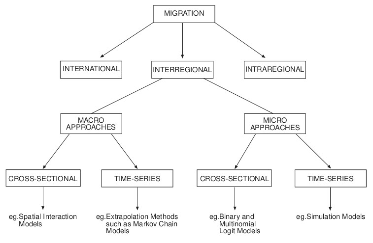
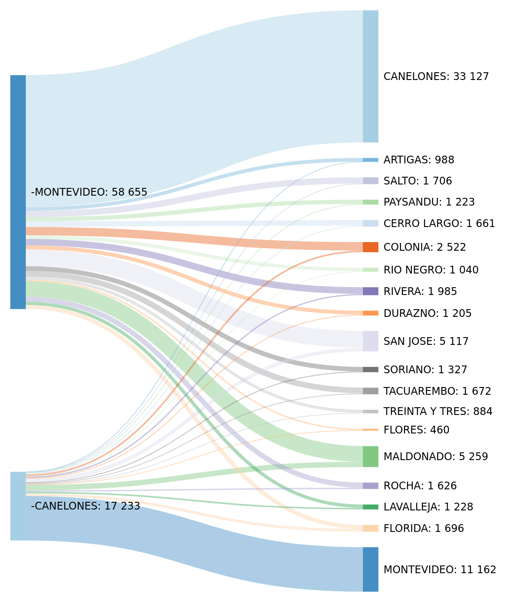
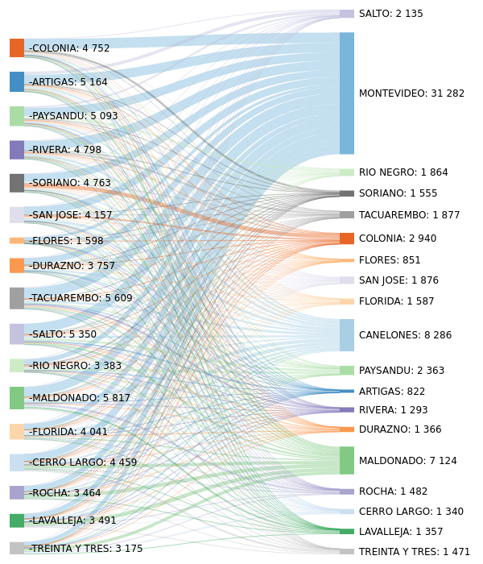

 

\newpage

# Introducción

*(La introducción se redactará cuando se llegue a etapas finales de la investigación)*

<!-- Este proyecto de investigación se enmarca en la geografía de la población, subdisciplina de la geografía humana, también llamada “geodemografía”. Situada en la intersección entre la demografía y la geografía, su objeto de estudio se puede definir como la organización geográfica de los grupos humanos y sus conexiones entre sí [@gregory2009], o más específicamente como la interacción entre las dinámicas demográficas y el espacio geográfico [@lopeztrigal2015; @puyol1995]. Dicho enfoque resulta pertinente en tanto las causas y consecuencias de las migraciones vinculan las relaciones sociales, económicas y espaciales, en particular los desequilibrios o desigualdades territoriales [@lopeztrigal2015], es decir que la migración es un fenómeno de naturaleza espacial [@rogers2002]. Los límites disciplinares son difusos, dado que los objetos de estudio y los métodos suelen ser compartidos, no obstante es posible afirmar que la geografía de la población complementa el abordaje puramente demográfico, en tanto otorga una relevancia particular al componente espacial de los fenómenos [@puyol1995].

Consideramos valiosa la posibilidad de explorar que papel tiene el espacio geográfico en las migraciones internas, ya que desde nuestro enfoque teórico, el espacio geográfico no debería ser considerado como un mero escenario contenedor de las sociedades, sino como agente activo en la construcción de las mismas, es decir que existe una relación recíproca, aunque no lineal, entre el espacio y los fenómenos sociales [@puyol1995]. A modo de ejemplo vale mencionar como las migraciones se ven influidas por el espacio geográfico, generándose migraciones más intensas entre localidades cercanas o migraciones muy débiles entre localidades remotas, y en ese proceso también modifican y (re)construyen el espacio.

El interés en la proyección de escenarios junto con el estudio de las migraciones internas no remite únicamente a la posibilidad de explorar la aplicación de una metodología, sino también a la provisión de insumos para las políticas de población, de desarrollo urbano, desarrollo regional y ordenamiento territorial. En el caso de Uruguay, para el cual se prevé una continuidad del proceso urbanizador, así como de la presión demográfica sobre el área metropolitana de Montevideo y las zonas costeras [@calvo2012], generar dichos insumos para la reflexión se considera relevante.

Los modelos de interacción espacial devienen de los modelos gravitatorios, los cuales son representaciones matemáticas de la interacción entre dos entidades geográficas, permitiendo medir la importancia de las relaciones existentes entre esas dos entidades [@sanders2013a].

Su formulación más básica corresponde al modelo sin restricciones [@okelly2009; @patuelli2016; @champion1998]:

(@) $$ M_{ij} = kV_{i} W_{j} d_{ij}^{-\beta} $$

Donde $M_{ij}$ representan los flujos entre el origen *i* y destino *j*; $V_{i}$ y $W_{j}$ representan las masas de origen y destino respectivamente; y $d_{ij}$ elevado a la ${-\beta}$ es el efecto de la distancia, que disminuye o disuade las interacciones. Los índices *'i'* y '*j*' refieren a entidades geográficas, que en conjunto forman una díada, y entre los cuales existe un flujo [@okelly2009].

Luego se pueden aplicar restricciones en origen o destino y sumar variables que se consideran explicativas de determinados flujos que se quieran modelar [@patuelli2016].

En el Uruguay existe un antecedente de investigación utilizando modelos de interacción espacial, pero orientada a la movilidad por trabajo [^3]. No existen antecedentes nacionales de uso de modelos de interacción espacial aplicados a migraciones internas. En ese sentido, la presente investigación cubre un vacío en la literatura académica al respecto.

[^3]:Trabajo inédito, dirigido por la Lic. Eugenia Riaño. 

\newpage-->

# Planteo del problema y pregunta de investigación

El estudio de las migraciones internas es pertinente para la Demografía en tanto la migración es uno de los factores del cambio demográfico. Asumiendo el componente espacial que implican los movimientos de población, el abordaje con técnicas de la geografía humana se considera adecuado.

La pregunta general que guiará este trabajo de investigación es la siguiente: ¿cuál será la magnitud de la migración interna en Uruguay en 2025?

## Objetivos

**Objetivo general**

- Generar escenarios de migración interna en Uruguay mediante la utilización de modelos de interacción espacial (MIE) con base en los datos del censo 2011.

**Objetivos específicos**

* Describir el perfil sociodemográfico de la población migrante interna, intentando identificar diferencias según el tipo de flujo migratorio.

    * Preguntas de investigación: *¿Cuál es la estructura demográfica de la población migrante interna? ¿Cuál es su nivel educativo?*

* Explorar el rol del espacio geográfico en las migraciones internas en Uruguay.

    * Preguntas de investigación: *¿Es la distancia un factor de relevancia en las migraciones internas? ¿Ha cambiado el papel que tiene la distancia como factor de disuasión según los datos del Censo 1996 y 2011? ¿Es relevante la contigüidad geográfica, es decir la existencia de fronteras compartidas?*

* Calibrar y aplicar un modelo de interacción espacial de las migraciones entre departamentos.

    * Preguntas de investigación:

* Explorar la aplicabilidad de modelos de interacción espacial para la estimación de escenarios de migración interna.

    * Preguntas de investigación: 

\newpage

# Marco teórico y antecedentes

A continuación se presenta el marco teórico y el relevamiento de antecedentes. El marco teórico se divide en tres apartados. En el primero se revisan las teorías migratorias y su vinculación con las migraciones internas. En el segundo se realiza una breve revisión del concepto de “espacio geográfico” y sus posibles relaciones con el abordaje de las migraciones internas que se propone realizar en la investigación. En el tercer apartado se analizan los fundamentos teóricos de la interacción espacial y los abordajes para su análisis.

Los antecedentes se dividen en dos apartados, el primero dedicado a la migración interna en Uruguay y el segundo a aplicaciones internacionales de modelos de interacción espacial para el estudio de la migración interna.

## Introducción a las teorías migratorias

Las migraciones internas difieren de la **movilidad residencial** y la **movilidad pendular**. La movilidad residencial implica “mudanzas” de menor jerarquía en términos de la distancia entre la antigua y la nueva residencia, en comparación con la migración. Estos cambios le permitirían a la persona que se muda mantener el mismo trabajo y frecuentar los mismos grupos sociales [@dennett2018]. Por otro lado, la movilidad pendular es aquella que tiene frecuencia diaria o semanal, con el fin de asistir a lugares de trabajo o centros de estudio. A pesar de las anteriores definiciones, es necesario aclarar que la migración interna y la movilidad residencial forman en realidad un continuo, no existiendo un criterio absolutamente claro de demarcación entre ambas [@dennett2018], es decir que la separación de estos dos conceptos es esquiva desde el punto de vista teórico pero puede ser resuelta operativamente. En la misma línea argumental, vale destacar que tanto el concepto de residencia como la unidad espacial que se tome de referencia, alteraran el concepto de migración, y esta característica diferencia a las migraciones de otras variables demográficas: nacimientos y defunciones son fenómenos absolutos en tanto migrar es relativo [@macadar2009].
El estudio de las migraciones en general se divide entre internacional e interna, entre otras varias posibilidades de clasificación (como voluntarias o forzadas, temporales o permanentes, etc.).

El conocimiento convencional deriva en forma automática hacia algunos factores que pueden ser determinantes en el proceso migratorio: diferencias geográficas de ingresos monetarios, empleo y oportunidades de desarrollo personal [@king2012]. Sin embargo la decisión y posibilidad de migrar no se ve relacionada en forma unívoca a estos factores, siendo un fenómeno complejo.

Los inicios de la teorización sobre las migraciones datan de fines del siglo XIX [@dehaas2015]. Hacia los años 1980s, el foco de la producción académica relativa a migraciones comienza a virar del estudio de las migraciones internas a las internacionales, al punto que hoy “migración” refiere en general a “migración internacional”, aún siendo las migraciones internas más importantes si se atiende a la cantidad de personas que involucran ambos fenómenos [@king2010; @king2012].

De Haas et. al. [-@dehaas2015] diferencian, siguiendo a @massey1993, entre aquellas teorías orientadas a las causas de la migración y aquellas orientadas a los impactos en las sociedades emisoras o receptoras. Los autores proponen un esquema que permite categorizar los procesos migratorios y las teorías que los abordan, conceptualizando a los movimientos migratorios como el resultado de la interacción entre estructuras macro y micro, en tanto proponen la existencia de meso-estructuras que vinculan las dos anteriormente mencionadas, proveyendo una explicación para la continuidad espacio-temporal de los procesos migratorios.

A su vez, los autores identifican dos paradigmas principales en los cuales agrupar las teorías que dan origen a los procesos migratorios: el **funcionalista** y el **histórico-estructural**. Según el paradigma funcionalista, la sociedad puede ser analizada como un sistema, como la interacción de diferentes partes interdependientes y tendientes al equilibrio. Por otro lado, el paradigma histórico-estructural pone foco en los factores sociales, económicos, culturales e históricos que constriñen y dirigen el comportamiento de los individuos, en formas que generalmente no tienden al equilibrio, sino que refuerzan los desequilibrios preexistentes [@dehaas2015].

-------------------------------------------------------------
AGREGAR ESQUEMA DE TEORÍAS MIGRATORIAS, A SUGERENCIA DE MARTÍN: VER ARANGO (EN REALIDAD CREO QUE ESTÁ EN DE HASS)

CUADRO DE LA PRESENTACIÓN AD 2 ?
------------------------------------------------------------

## La migración interna en Uruguay

Los primeros antecedentes del estudio de la migración interna en Uruguay se centraron en la exploración de las causas de la migración rural-urbana y el consecuente declive de la cantidad de personas viviendo en zonas rurales [@prates1977; @petruccelli1979; @macadar2008].

El trabajo de Petruccelli [-@petruccelli1979] se basa en los censo 1963 y 1975, y en el mismo se realiza un análisis de atracción/repulsión a nivel departamental. En su trabajo ya se apunta a la metropolización de Montevideo como factor determinante en la reducción de las migraciones a Montevideo. Otro factor que el autor identifica es la migración internacional, cuyo origen se define mayoritariamente como Montevideo (atender a los años que abarca el estudio, el período de implantación de gobierno dictatorial). A su vez presenta el cálculo del coeficiente de atracción mutua (CAM).

Posteriormente, Calvo [-@calvo1995] realiza un análisis similar pero con el censo 1985, complementado con un abordaje a nivel de secciones censales.

Más recientemente se realizaron algunos estudios descriptivos, usando datos censales, Encuesta Continua de Hogares y Encuesta de Hogares Ampliada [@bengochea2011; @koolhaas2013; @macadar2008; @macadar1995; @pellegrino2009].

Según los datos del Censo INE 2011, solamente los departamentos de Maldonado, Canelones, San José, Colonia, Salto y Río Negro ha habido un aumento de la población [@koolhaas2013]. A su vez, dentro de esos departamentos, solo Maldonado, Canelones, San José y Colonia tuvieron un saldo migratorio interno positivo [@koolhaas2013]. En particular Canelones y Maldonado, ambos departamentos costeros, presentan crecimiento poblacional desde el censo de 1963 [@koolhaas2013; @bengochea2011], en parte asociado a la expansión de la ciudad de Montevideo (procesos de suburbanización), la generación de nuevas centralidades y el crecimiento de Maldonado (y su propio proceso de suburbanización).

\input{tablas/mig_censos.tex}

La migración es más intensa en las edades económicamente activas y en los jóvenes [@koolhaas2013]; a su vez la migración reciente tiene más incidencia en mujeres jóvenes, probablemente asociada a la feminización de la matrícula universitaria y a la atracción de Montevideo por la existencia de mayor oferta laboral para las mujeres [@bengochea2011]. La propensión a migrar de los jóvenes se puede comprender atendiendo a las características de ese período vital: formación de pareja, inicio de la vida reproductiva, inicio de estudios terciarios, inicio de la vida laboral, etc. [@koolhaas2013].

Quienes migran desde Montevideo tienen un perfil más joven y feminizado de quienes migran hacia Montevideo [@bengochea2011]. Por otro lado, se ha caracterizado a quienes migran desde Montevideo como familias integradas por parejas de entre 30 y 40 años con niños, probablemente debido a un ciclo de expansión de dichas familias [@bengochea2011].

## Modelos de interacción espacial y migraciones

Los abordajes para modelar migraciones son variados, siendo los modelos de interacción espacial una de las opciones.

En líneas generales vale mencionar las cuatro categorías propuestas por Champion et al. [-@champion1998] para diferenciar los abordajes: abordajes micro o macro; abordajes basados en series temporales o de corte transversal. Según dicha clasificación los modelos de interacción espacial son un abordaje a nivel macro y de corte transversal.

{#fig:migration_app}

A pesar de no contar con antecedentes nacionales de uso de modelos de interacción espacial para el estudio de las migraciones, existen varios antecedentes internacionales de su aplicación.

Referido a España, Santos [-@santos1994] aplicó modelos de interacción espacial a matrices de flujos migratorios interregionales en dos períodos diferentes (1970 y 1990), usando datos censales y con intenciones explicativas, no predictivas. A la matriz de flujos se incorporan las distancias euclidianas relativas, la jerarquía urbana medida por el volumen de la población, un factor de rechazo de los lugares de origen medido por el porcentaje de la población activa agraria, un factor de atracción de los lugares de destino medido por el porcentaje de población con empleos en el sector industrial y el nivel de los salarios y una variable *dummy* indicando la contigüidad geográfica (es decir si hay o no limites compartidos), llegando a la siguiente expresión del modelo:

(@) $$T_{ij} = K P_{i}^{\alpha} P_{j}^{\beta} d_{ij} ^{-\gamma} e^{\lambda b_{ij}}$$

En ambos casos (1970 y 1990) el volumen de población de los lugares de origen y destino, o “jerarquía urbana”, se identifican como los factores más estables y relevantes para explicar las causas de la migración.

Por su parte, Devillanova y García-Fontes [-@devillanova1998] estudiaron la migración interna en España con datos de la seguridad social, utilizando un modelo de regresión con especificación Binomial Negativa, abarcando los períodos 1978-1984 y 1986-1992. Los autores identificaron como variables relevantes el desempleo y el bajo crecimiento del empleo para el período 1986-1992, en tanto que en el período anterior no tuvieron un papel de relevancia.

Garrocho [-@garrocho1996] utilizó un modelo de interacción espacial condicionado en origen para simular flujos de migración interna en México, también a escala interregional, y sobre esa base genera escenarios migratorios hipotéticos.

La aplicación del modelo se divide en dos partes: la calibración y la simulación. La calibración consiste en el cálculo de los valores de las variables y parámetros de las unidades espaciales y la atractividad migratoria, para encontrar los valores que mejor replican los datos del Censo. En segundo lugar la simulación, es decir la aplicación del modelo con los parámetros calibrados, pero modificando los valores de las variables explicativas, para generar escenarios posibles [@garrocho1996]. Mediante el proceso de calibración llega a un factor de bondad de ajuste aceptable y un error promedio de asignación bajo, con algunas incongruencias derivadas de las particularidades de las migraciones internas mexicanas, por ejemplo la migración a estados fronterizos con EE.UU. como parte de una estrategia de migración internacional hacia EE.UU. Dicho modelo calibrado es utilizado para aventurar algunos escenarios futuros.

Boyle et al. [-@boyle1998] modelaron la migración entre los distritos electorales de Hereford y Worcester, Inglaterra, entre 1990 y 1991. Como conclusión se destacan que la función de distancia más apropiada fue la exponencial negativa, en lugar de la función potencial. Con respecto a las variables adicionales, se encuentran asociaciones positivas con el tamaño poblacional, la finalización de viviendas privadas nuevas durante el período de estudio y la presencia de vivienda pública (*council housing*).

Yano el al. [-@yano2003] aplicaron modelos de interacción espacial para comparar las conductas migratorias en Japón y Gran Bretaña con datos de principios de los años 90s, identificando que en ambos casos el grado en que afecta la distancia como factor de disuasión de la migración se mantiene en ambos países. Por otro lado, encuentran diferencias en las preferencias de hacia donde migrar, siendo las grandes áreas urbanas más atractivas para los migrantes internos en Japón, en tanto en Gran Bretaña se da lo contrario, hecho que los autores relacionan con diferencias culturales y por encontrarse ambos países en momentos diferentes del desarrollo.

He y Pooler [-@he2003] aplicaron un modelo de interacción espacial restringido en origen y con variables adicionales, para modelar la migración inter-provincial en China, a partir de datos de los períodos 1982-87 y 1985-90. Utilizaron como función de la distancia una función de potencia inversa. Las variables adicionales incorporadas al modelo fueron: la migración pasada en origen y destino (llamada *stock* de migrantes) y una medida de inversión promedio anual, llegando a la siguiente formulación del modelo:

(@) $$M_{ij} = h_{j} s_{ij} A_{i} O_{i} d_{ij} ^{-\beta}$$

dónde $A_{i}$ es el factor de balance, definido cómo:

(@) $$A_{i} = \left[{\sum_{j} h_{j} s_{ij} d_{ij}^{-\beta}} \right]^{-1}$$

$M_{ij}$ es el valor de migrantes entre provincias que predice el modelo, es decir la variable dependiente.

$h_{j}$ es el promedio de la  inversión anual total

$s_{ij}$ es el stock de migrantes

$O_{i}$ es la cantidad de migrantes salientes

$d_{ij}^{-\beta}$ es la función de distancia

Los autores basan la elección del *stock* de migrantes como variable independiente en la producción teórica relativa a la migración en cadena, posteriormente relacionada con la teoría de las redes sociales, la cual consideran relevante en las migraciones internas de China, principalmente en el marco de los movimientos rural-urbano.

Para seleccionar la variable adicional en destino, analizaron la correlación entre seis variables relevantes y luego calibraron el modelo con las seis variables, para seleccionar aquella que mejorara la performance del mismo. A partir de esos dos criterios concluyen que lo más adecuado es incluir la variable "inversión promedio total anual". Como conclusión destacan la mayor precisión alcanzada por el modelo con variables agregadas por sobre el modelo convencional.

Shen [-@shen2017] también analizó la migración interna en China, identificando como variables relevantes la distancia, la población en origen y destino, un indice de severidad de la temperatura en 2005 en destino, las exportaciones como porcentaje del producto bruto interno en 2005 en destino, los ingresos per cápita en población rural en 2005 en destino y la densidad de población de 2005 en destino.

Yaojung et al. [-@yaojun2019] realizaron un índice de atractividad relativa para las prefecturas de China, siguiendo el trabajo desarrollado por Fotheringham et al. [-@fotheringham2000]. Los autores concluyen que la región central de China es la menos atractiva para los migrantes, que las grandes ciudades son más atractivas que las medianas y pequeñas y que la atractividad es variable según los grupos de edad y el nivel educativo de los migrantes.

Sarra y Del Signore [-@sarra2010] aplicaron un modelo de interacción espacial restringido en origen para Polonia. Las autoras concluyen que el producto bruto interno *per cápita* es la variable que más peso tienen en la explicación de los flujos, pero a su vez destacan el escaso peso de la variable distancia y el signo negativo del coeficiente de la variable población, que atribuyen a un contexto de declive urbano, es decir características propias de la economía polaca a principio del siglo XXI.

Poot. et al [-@poot2016] aplicaron modelos de interacción espacial para el análisis de la migración interna en Nueva Zelanda. Como particularidad vale mencionar la inclusión de las migraciones internacionales como parte del modelo. Dado que la formulación del modelo aplicado es de tipo logarítmica, a las díadas con flujos nulos (es decir sin flujos) se les imputa un valor de 0,5.

Otra característica a destacar del estudio es el uso de varias medidas de distancias, así como distancias/tiempo históricas complementadas con distancias/tiempo actuales (obtenidas de Google Maps).

Como resultado no identifican que el acortamiento de las distancias y tiempos de viajes entre localidades haya implicado un aumento de los flujos migratorios. *A posteriori* los autores analizan las posibilidades de incorporación de proyecciones demográficas a nivel subnacional. Finalmente, los autores destacan el aumento reciente en el interés académico por los modelos gravitatorios y las migraciones, que atribuyen en parte a la mayor disponibilidad de datos diádicos y por el mayor flujo de personas (ya sea por migraciones o movilidad pendulares).

Existen dos antecedentes de gran relevancia, ya que son aplicaciones guiadas implementadas en software R [@dennett2012; @dennett2018]. La primera refiere a la aplicación sobre datos de migración interna de Austria [@dennett2012]. La segunda se enfoca en la migración interna en Australia, aplicando tres de los cuatro modelos de la familia de Wilson: restringido en origen, restringido en destino y de resitricción doble [@dennett2018]. Se extraen flujos de migración y las siguientes variables: población total, tasa de desempleo, ingreso mediano semanal y porcentaje de hogares cuya vivienda es alquilada. A partir de esos datos se construye la matriz origen-destino entre 15 unidades geoestadísiticas que cubren todo el territorio australiano. En las tres aplicaciones usa un modelo de regresión de Poisson, siguiendo las recomendaciones de Flowerdew [-@flowerdew2010], también mencionadas en Patuelli et al. [-@patuelli2016], para seleccionar los coeficientes que mejor ajustan el modelo. Los modelos estimados se utilizan para predecir los flujos migratorios entre las unidades geoestadísiticas.

Del mismo autor se relevó un el desarrollo de un modelo de interacción espacial multinivel para la estimación de la migración interregional en Europa [@dennett2013].

Una de las limitantes de los modelos de interacción espacial presentes en la literatura, refiere al sesgo de endogeneidad por variables omitidas. Tal como se establece en la revisión teórica, la migración no es considerada un proceso aleatorio, sino que emerge de las decisiones de los migrantes, las cuales son tomadas en determinados contextos espaciales [@peeters2012]. Peeters [-@peeters2012] propone dar cuenta de las particularidades de la estrucutra espacial utilizando pendientes bilaterales, es decir entre cada díada. El mismo problema es mencionado por Patuelli et al. [-@patuelli2016a] y fue abordado por Lamonica [-@lamonica2018], quien analizó alternativas para el problema de la dependencia espacial o autocorrelación espacial, utilizando datos de cambios de residencia entre regiones de Italia, y también por Mitze [-@mitze2016], quien analizó la migración interregional en Alemania.

Otro problema emergente, muy conocido en el ámbito del análisis espacial, es el Problema de la Unidad Espacial Modificable (PUEM), según el cual las unidades espaciales utilizadas para analizar un fenómeno determinado repercutirán sensiblemente tanto en la representación cartográfica como en el análisis estadístico [@mcnamara2016, @arbia2016]. En el caso de las migraciones internas, la modificación de las unidades espaciales de análisis también reviste una importancia absoluta, dado que si por ejemplo agrupamos dos departamentos, esos flujos desaparecen del sistema (se convertirían en cambios de residencia en lugar de migraciones internas). Una opción para dar cuenta de este problema es probar el modelo con diferentes unidades espaciales, para validar la robustez del análisis [@flowerdew2010].

A modo de cierre, vale destacar la diversidad de variables explicativas usadas por todos los casos referenciados. Sin embargo, en varios se utiliza una metodología *stepwise* para identificar la relevancia de cada variable, es decir que se corren varias veces los modelos agregando y quitando variables (seleccionadas previamente con un criterio teórico) hasta llegar a aquel conjunto reducido de variables que presentan mayor poder explicativo.

\newpage

# Marco metodológico

## Fuentes de información

La principal fuente de información para el presente trabajo serán los censos 1996 y 2011 realizados por el Instituto Nacional de Estadística (INE).
En particular los censos 1996 y 2011 incorporaron preguntas relativas a la migración interna y se presentan en el siguiente cuadro.

| Preguntas en censo 1996                                                                         | Preguntas en censo 2011                                                     |
|-------------------------------------------------------------------------------------------------|-----------------------------------------------------------------------------|
| En qué localidad o paraje vive habitualmente                                                    | (Se extrae de los datos de identificación del domicilio)                    |
| En qué localidad o paraje paso a vivir cuando nació                                             | En qué localidad o paraje pasó a residir cuando nació                       |
| Si reside en Uruguay y nació en el extranjero, ¿en qué año llegó al Uruguay para vivir en él?   | (Si nació en el extranjero) ¿En qué año llegó a Uruguay para residir en él? |
| En qué localidad o paraje vivía habitualmente hace 5 años en esta fecha                         | En qué localidad o paraje residía en hace cinco años                        |

Table: Preguntas relevantes para el análisis de la migración interna en los censo INE 1996 y 2011.

Aquí surge una primera complejidad, asociada a los ya mencionados solapamientos entres las movilidades pendulares, las residenciales y las migraciones, y refiere a la operacionalización del concepto de migrante interno. Según la información disponible en Censo INE [@ine2011c], el criterio más adecuado sería usar los datos relevados en la pregunta "lugar de residencia 5 años antes", la cual puede tomar los siguientes valores: "en otra localidad o paraje de este departamento" y "en otro departamento"
  
Se encuentran al menos dos limitaciones. En primer lugar se excluyen habitantes de zonas rurales de población dispersa, es decir aquellas asignadas a la localidad INE rural, cuya expresión geográfica se limita a toda la superficie del departamento que no se considera urbana, por ende es demasiado amplia. Para estudiar las migraciones referidas al ámbito rural, habría que tomar otra estrategia u otra fuente de datos. En segundo lugar, residir en otro departamento con anterioridad no necesariamente debería ser una migración. Por ejemplo, una hogar con residencia en Ciudad del Plata o Ciudad de la Costa, cuya residencia 5 años antes era en Montevideo, ¿migró o simplemente cambió de residencia?. Aquí es donde la distancia del movimiento realizado puede servir como variable auxiliar para determinar a que categoría corresponde.

En lo que refiere a capas de información geográfica, fueron empleadas la capa de departamentos y la de localidades del INE como información básica. Los departamentos son unidades geoestadísticas y político-administrativas de segundo nivel de gobierno, las localidades definidas por el INE son unidades geoestadísticas que, en general, corresponden a zonas urbanas.

Con la combinación de los datos geográficos y los censales se realizaron ciertas operaciones para producir nueva información geográfica, las cuales se detalla en el apartado "Generación de datos diádicos".

Como datos relativos a la actividad económica, se extrajeron los valores de PBI departamental para el año 2014 estimados por el Observatorio "Territorio Uruguay" de la Oficina de Planeamiento y Presupuesto [@opp2016]

## Factores asociados a las migraciones internas

Existen varias razones que pueden estar detrás del interés de migrar de una personas y la concreción de dicho movimiento, a continuación se analizan algunos de los factores que según la literatura se asocian al proceso migratorio.

Como variables demográficas, la edad y sexo/género se consideran determinantes en los procesos migratorios, ya que la propensión a migrar varía notablemente con la edad, asociada al ciclo vital de los individuos [@champion1998; @vandergaag2003]. En general, se constata un alta tasa en niños pequeños, con un posterior declive que repunta al comienzo de los 20 años, asociado a las oportunidades educativas y de trabajo. Luego hay un declive asociada a la edad de crianza de los niños, pudiendo aumentar en la edad del retiro [@vandergaag2003]. Esas aseveraciones varían según las características de la sociedad que se analize.

Varias investigaciones han identificado variables económicas relacionadas con la atracción de migración interna como ser ingresos per cápita, puestos de trabajo vacantes, empleo [vandergaag2003; @lucas1997, @aldashev2011; @aldashev2014; @andrienko2004; @fang2003, @etzo2011; @weidlich1988, @cebula2005; @cebula2006; @filiztekin2008; @piras2017; @royuela2018]. También la recepción de inversión extranjera directa ha sido usada como variable explicativa, en función del dinamismo económico que implica para determinadas regiones [@fang2003].

La disponibilidad de vivienda pública [@champion1998; @andrienko2004] o variables relativas a los mercados de vivienda también han sido incorporadas en algunas investigaciones [@vandergaag2003].

Otros han incorporado factores relativos a la calidad de vida, como la incidencia del crimen violento como factor de disuación, en tanto que las horas de luz solar, la superficie de parques públicos [@cebula2005; @cebula2006] o el grado de urbanización [@royuela2018] han diso identificados como atractores.

Entre los aspectos sociales, vale mencionar los años de escolarización como factor relevante [@royuela2018; @piras2017].

Algunos estudios también se refieren a variables de stock, por ejemplo el stock de migrantes anteriores entre provincias, o a las variables geográficas, como la distancia entre provincias (por ejemplo Fang y Dewen [-@fang2003] toman las distancias entre provincias por vías férreas para el caso de China), la combinación de la distancia y factores étnicos [@aldashev2014], o variables *dummies* para representar particularidades de determinado país o región [@filiztekin2008; @etzo2011]

Dada la relevancia de ciertos aspectos micro que hacen a la desición de migrar, Van Der Gaag et al. [-@vandergaag2003] recomiendan incorporar una perspectiva de ciclo de vida, en particular la edad, a la modelación. A su vez, ateniéndonos a la realidad Uruguaya, según el análisis realizado por Macadar y Domínguez [-@macadar2008] a partir de datos de la Encuesta de Hogares Ampliada el año 2006, la razón principal de los migrantes es la de "motivos familiares", quedando los motivos laborales y educativos en segundo y tercer lugar. Esas afirmaciones destacan la importancia de considerar otros factores a nivel micro que pueden ser minimizados en abordajes basados exclusivamente en factores macro.

\newpage

# Análisis exploratorio de datos

En continuidad con la revisión de antecedentes sobre el estudio de la migración interna en Uruguay, se presenta un análisis exploratorio de los datos censales, para dar un marco general con un enfoque demográfico.

En primer lugar se procede a operacionalizar el concepto de **migrante interno**, según las opciones que presenta el Censo INE 2011 [@ine2011].

Podemos distinguir entre **migrantes absolutos**, es decir aquellos que viven en un departamento diferente a aquel en que nacieron, y por otro lado los **migrantes recientes** [@busso2009; @morrison2004]. Dado que la migración absoluta abarca un horizonte temporal muy amplio, se tomará la categoría migrante reciente como unidad de análisis.

El Censo INE 2011 [@ine2011] permite distinguir ambas categorías. Para operacionalizar la categoría de migrante interno reciente a partir de los microdatos del Censo, tal cual se mencionó anteriormente, se identifica el subgrupo que declaró vivir en otro departamento ante la pregunta del Censo referida al lugar de residencia 5 años antes. El total de migrantes internos según la definición tomada es de 148.759 personas.

{#fig:mapa_gemelo}

El rol de Montevideo como receptor se puede vincular a la histórica concentración de servicios en la capital [@bengochea2011], así como a la concentración de actividad económica en general. El departamento de Canelones también figura como atractor, y en parte se puede asociar a la metropolización de la ciudad de Montevideo, es decir la expansión de su "mancha urbana" hacia el este, incorporando la zona costera de Canelones (Ciudad de la Costa), como proceso de suburbanización [@hernandez1999b; @folgar2005; @dangelo2016].

Dicho proceso puede ser constatado analizando las principales localidades de destino de los migrantes internos que anteriormente residían en Montevideo. Tal cual se expresa en las\ [@fig:mig_ori_mvo] y\ [@fig:mig_ori_mvo_zoom] el destino de preferencia es el área metropolitana en primer lugar, en particular la costa de Canelones, seguido de otras localidades costeras.

{#fig:mig_ori_mvo}

Los 7 principales destinos corresponden a localidades del área metropolitana, y suman el 27% de las personas migrantes internas con origen en Montevideo.

{#fig:mig_ori_mvo_zoom}

En el mismo sentido, considerando las localidades del área metropolitana como una entidad conjunta que aglomera partes de Canelones y San José (Ciudad del Plata), el resultado del destino de los migrantes recientes con origen en Montevideo se puede apreciar en la\ [@tbl:mig_am].

| Entidad geográfica   |   personas |   porcentaje |
|:---------------------|-----------:|-------------:|
| Área metropolitana   |      32750 |        58.45 |
| Artigas              |        894 |         1.6  |
| Canelones (no A.M.)  |       1989 |         3.55 |
| Cerro Largo          |       1355 |         2.42 |
| Colonia              |       2015 |         3.6  |
| Durazno              |        930 |         1.66 |
| Flores               |        339 |         0.61 |
| Florida              |        886 |         1.58 |
| Lavalleja            |        746 |         1.33 |
| Maldonado            |       3830 |         6.84 |
| Paysandú             |       1059 |         1.89 |
| Río Negro            |        821 |         1.47 |
| Rivera               |       1626 |         2.9  |
| Rocha                |       1211 |         2.16 |
| Salto                |       1480 |         2.64 |
| San José (no A.M.)   |        921 |         1.64 |
| Soriano              |       1117 |         1.99 |
| Tacuarembó           |       1329 |         2.37 |
| Treinta y Tres       |        730 |         1.3  |
| Total                |      56028 |       100    |

Table: Migrantes recientes con origen en Montevideo, por departamentos y área metropolitana de Montevideo. {#tbl:mig_am}

Esta realidad plantea un debate: **¿es adecuado considerar esos movimientos como migraciones internas o sería más preciso categorizarlas como simples cambios de residencia?**

Aunque Montevideo sea un atractor relevante en números absolutos, si atendemos al porcentaje de población migrante interna con respecto a la población total de cada departamento, Canelones y Maldonado son los departamentos que lideran. En el caso de Maldonado, se puede atribuir al dinamismo económico derivado de la actividad turística, así como del sector de la construcción.

El grupo de migrantes internos puede ser dividido en tres subgrupos [@bengochea2011], que para el presente análisis denominaremos grupo 1, 2 y 3:

- **Grupo 1**: 42.444 personas con origen en el interior del país pero residentes el Montevideo.

- **Grupo 2**: 58.655 personas migrantes con origen en Montevideo pero residentes en el Interior del país.

- **Grupo 3**: 47.660 personas con origen y residencia en el interior, pero en departamentos distintos.

A continuación se presentarán diversos indicadores referidos a dichos tres grupos, a modo de carcterización.

## Estructura de la población

A continuación se presenta un breve análisis de la población migrante interna en función de su estructura. A parte del análisis siguiente, se elaboró un tablero interactivo, que permite visualizar parte de esta información en forma dinámica, pudiendo acceder al mismo mediante el siguiente enlace: https://share.streamlit.io/guillermodangelo/migraciones_internas/main/app.py

### Distribución por sexo

El índice de masculinidad para el grupo 1 es de 80 hombres por cada 100 mujeres, para el grupo 2 de 92.4 y para el grupo tres es de 102.2 hombres por cada 100 mujeres. Dichos datos se presentan en forma gráfica en la\ [@fig:barras_mascul].

{#fig:barras_mascul}

Los valores mencionados indican la mayor proporción de mujeres en el grupo 1, posiblemente asociado a la matrícula universitaria, ya que esta se caracteriza por ser feminizada [@bengochea2011; @universidaddelarepublica2013]. Además la oferta educativa de la Universidad de la República, la principal universidad del país y de carácter público, se concentra en Montevideo (el impulso a la descentralización de la Udelar fue posterior a la realización del Censo 2011). Por el contrario, el grupo 3 presenta una leve masculinización con respecto a la mediana del país, posiblemente asociado a migraciones por trabajo relacionadas al sector agropecuario o al medio rural.

La\ [@fig:porcen_sexo] ilustra la distribución por sexo dentro de los grupos, coincidiendo con las apreciaciones anteriores.

{#fig:porcen_sexo}

### Composición por edades

Atendiendo a la composición por edades, las **edades medianas** para cada grupo son de **23, 32 y 28 años respectivamente**, en tanto el valor para el país es de 34 años. Es decir que son poblaciones levemente más jóvenes, con excepción del grupo 1, que es considerablemente más joven que el total de la población.

{#fig:edad_mediana}

La distribución por grupos de edades en la\ [@fig:grupos_edades]
evidencia dicha estructura, con mayor concentración de la población en el tramo de las personas económicamente activas en los grupos migrantes, siendo el grupo 1 en el cual esta población tiene mayor presencia.

{#fig:grupos_edades}

La\ [@fig:distri_edades] presenta la distribución por edades, brindando un poco más de detalle sobre la conformación estructura de los grupos. El grupo 1 presenta un pico en el tramo 18-25 años, coincidente con la edad característica de los estudiantes universitarios, en tanto el grupo 2 presenta más concentración en el grupo 25-35 años. El grupo 3 presenta concentración en las edades 18-25 años, pero también abarca personas en el grupo 25-35 años.
Los grupos 2 y 3 también están conformados por niños y jóvenes, por oposición al grupo 1; pero el grupo 2 presenta mayor proporción de niños y menor de jóvenes, lo cual estaría indicando que refiere a hogares de parejas en el tramo 25-35 años, con niños.

{#fig:distri_edades}

### Pirámides de población

La distribución por sexo y tramos de edad se puede integrar en pirámides de población, que dan cuenta de la estructura de la población en forma más abarcadora.
La pirámide de los migrantes internos, como es de esperar, concentra población en las edades económicamente activas en comparación con la pirámide de todo el conjunto de población censada. A su vez, es una población más feminizada, sobre todo en los tramos de edad entre 15 y 34 años.

Comparando las pirámides de los grupos 1, 2 y 3 en la\ [@fig:piramides_mig_rec], se pueden identificar visualmente varias de las afirmaciones hechas con anterioridad. En particular la estructura de la pirámide correspondiente al grupo 2, que estará indicando hogares conformados por parejas de mediana edad y con niños, posiblemente muchos refieran a movimientos desde Montevideo hacia la costa de Canelones, en el marco del proceso de metropolización anteriomente mencionado.

{#fig:piramides_mig_rec}

Para profundizar en las diferencias del grupo 1 con el resto de los grupos, se analiza el promedio de personas que componen los hogares dentro de los cuales hay al menos una persona migrante. En general los hogares que conforman el grupo 1 tienen menos integrantes, y los del grupo 3 tienen más. Se excluyen de estos cálculos a los hogares colectivos (pensiones, hogares estudiantiles, cuarteles miitares, prisiones, etc.)

{#fig:prom_perso_hogar}

En el mismo sentido, el porcentaje de personas migrantes internas viviendo en hogares colectivos, como ser hogares estudiantiles, es mucho mayor en el grupo 1.

{#fig:viv_colectivas}

## Nivel educativo

Otro factor de interés para la caracterización es el nivel educativo de la población migrante interna. En lo que refiere a la asistencia a un centro educativo, el grupo 1 se destaca por quienes declaran asistir tanto a centros públicos como privados.

El grupo 1 también se diferencia en cuánto al nivel educativo actual en el momento del censo, con la preeminencia de aquellos cursando estudios terciarios, principalmente universitarios.

En cuanto al nivel educativo más alto alcanzado, se puede apreciar que los grupos 1 y 2 tienen una distribución prácticamente similar, en tanto el grupo 3 presenta menor porcentaje de personas que han alcanzado los estudios universitarios, aún en comparación con los porcentajes de toda la población.

## Coeficientes de atracción mutua entre departamentos

Los coeficientes de atracción mutua dan información sobre la intensidad de flujos entre departamentos.

(@) $$CAM = \left ( \frac{M_{ij} + M_{ji} }{P_{i} + P_{j}} \right ) \times1000$$

 Dónde $M_{ij}$ es la corriente del departamento i al j y $M_{ij}$ la del j al i, $P_{i}$ y $P_{j}$ son las poblaciones en origen y destino.

Macadar y Dominguez [-@macadar2008] lo calcularon a partir de los datos del Censo 1996. Filtrando los datos del censo 2011 y aplicando la fórmula mencionada se pueden calcular los mismos coeficientes para el 2011 (ambas matrices se pueden ver en el Anexo).

Dicha matriz se puede representar en forma gráfica.

La representación gráfica de las diferencias entre ambas matrices indica una tendencia general a la estabilidad o reducción de la atractividad entre díadas, con algunas excepciones.

De la comparación surgen 14 díadas que aumentan su coeficiente de atractividad, 186 que lo mantienen y 142 que lo reducen. A continuación se presentan las díadas que aumentan su atractividad, evidenciando que en todos los casos los aumentos son de 1 unidad máximo.

| Dpto. Origen   | Dpto. Destino   |   CAM 1996 |   CAM 2011 | n Migrantes |
|:---------------|:----------------|-----------:|-----------:|------------:|
| Colonia        | Montevideo      |          3 |          4 |        2690 |
| Montevideo     | Colonia         |          3 |          4 |        2100 |
| Florida        | San José        |          3 |          4 |         321 |
| San José       | Florida         |          3 |          4 |         252 |
| Río Negro      | Colonia         |          1 |          2 |         176 |
| Salto          | Río Negro       |          1 |          2 |         161 |
| Río Negro      | Salto           |          1 |          2 |         133 |
| Colonia        | Río Negro       |          1 |          2 |          88 |
| Cerro Largo    | Paysandú        |          0 |          1 |          61 |
| Tacuarembó     | Lavalleja       |          0 |          1 |          50 |
| Lavalleja      | San José        |          0 |          1 |          45 |
| Lavalleja      | Tacuarembó      |          0 |          1 |          45 |
| San José       | Lavalleja       |          0 |          1 |          44 |
| Paysandú       | Cerro Largo     |          0 |          1 |          35 |

Table: Cambios más pronunciados en los coeficientes de atracción mutua 1996-2011.

Se destacan las díadas Colonia-Montevideo y viceversa, posiblemente asociado a un mayor dinamismo económico en ambos departamentos.

## Magnitud de la migración interna

En cuanto a la representación gráfica la magnitud de la migración interna, los diagramas Sankey son adecuados. Dado que las diferencias en las magnitudes de los flujos son grandes, se presentan los flujos con origen en Montevideo y Canelones en un gráfico, y en otro gráfico el resto de los origenes.

Los flujos con origen en Montevideo y Canelones, a parte de ellos mismos como destino (algo ya analizado previamente), se dirigen con mayor intensidad a Maldonado y San José.

A partir de ambos gráficos se resalta el rol de Montevideo y Canelones, tanto como origen como destino. En segundo lugar se destaca Maldonado, fundamentalmente como destino. En un lejano cuarto lugar, aparece el departamento de Colonia como destino.

## Visualización de los flujos migratorios y las variables independientes

### El rol de la distancia en las migraciones internas

A continuación se presenta un breve análisis descriptivo relativo a la distancia en las migraciones internas, a partir de los censos 1996 y 2011.

Siguiendo los análisis presentes en la literatura, la distancia implica un reducción de flujos migratorios internos, que se puede visualizar graficando la cantidad de flujos contra la distancia de los mismos.

Utilizando la totalidad de flujos del censo 2011 se obtiene la siguiente gráfica.

En la misma se puede apreciar el rol disuasorio de la distancia, aunque dado el carácter atípico de los flujos con origen y destino en Montevideo, es conveniente graficar excluyendo dicho departamento.

Dicha disposición es relativamente similar con los datos del Censo 1996.

Atendiendo a los valores absolutos de los flujos migratorios de 1996 y 2011, en el período 1991-1996 estos eran mayores en general.

Por otro lado, si graficamos la distribución percentual, los datos del 2011 indican mayor concentración en distancias más cortas, en tanto que los del 1996 en distancias más largas.

Con respecto a la edad y la distancias de los flujos, se identifica un comportamiento similar al ya mencionado, relativo a la mayor incidencia en edades en torno a los 20 años, probablemente asociado a las migraciones para acceder a la educación universitaria.

En lo que refiere a las diferencias por sexo y su relación con la distancia de los flujos, se identifica una equiparación entres sexos en los datos de 2011, posiblemente asociada a la femenización de la masa de estudiantes universitarios.

### Otras variables independientes

Con respecto a la población en origen, utilizando una relación lineal, la representación gráfica no evidencia correlación entre dicha variable y la cantidad de flujos.

{#fig:flujos_vs_pob_origen}

Eliminando los valores de Montevideo y Canelones, tampoco se obtiene un gráfico que exprese una correlación relevante.

{#fig:flujos_vs_pob_origen_sin_mvo}

El PBI en destino evidencia una leve correlación con los flujos migratorios sobre todo al excluir Montevideo del análisis.

{#fig:flujos_vs_pbi_destino}

{#fig:flujos_vs_pbi_destino_sin_mvo}

\newpage

# Aplicación de modelos de interacción espacial

A continuación se presenta una aplicación de modelos de interacción espacial, basada en los datos del Censo INE 2011 publicados en su página web [@ine2011c]. A su vez, se utilizan las capas de polígonos de departamentos y de puntos de localidades del INE, identificando las capitales departamentales en esta última capa [@ine2011c]. La construcción de la base de datos asociados a cada díada queda documentada en el Anexo.

## Modelos de interacción espacial restringidos en origen

El modelo se define de la siguiente forma:

(@) $$T_{ij} = A_{i}O_{i}W_{j}^{\alpha}d_{ij}^{-\beta}$$

dónde

(@) $$O_{i} = \sum_{j}T_{ij}$$

(@) $$A_{i} = \frac{1}{\sum_{j}W_{j}^{\alpha}d_{ij}^{-\beta}}$$

En el modelo restringido en origen $O_{i}$ no tiene parámetro dado que refiere valores conocidos. $A_{i}$ es un factor de balance que refiere a cada origen $i$. Más específicamente $A_{i}$ permite que la suma de los valores estimados sea igual al total conocido $O_{i}$

La forma multiplicativa del modelo puede ser modificada, representando el modelo como un modelo de regresión de Poisson [@dennett2018]. Para ello se aplica el logaritmo al lado derecho de la ecuación, y asumiendo que están logarítmicamente vinculados a la media con distribución de Poisson ($\lambda_{ij}$) de la variable $T_{ij}$, se obtiene

(@) $$ \lambda_{ij} = \exp( \mu_{i} + \alpha \ln W_{j} - \beta \ln d_{ij} )$$

Reemplazamos la variable independiente (los estimados $T_{ij}$) por la media de la distribución de Poisson $\lambda_{ij}$, la cual se asume como modelada por una combinación lineal de las variables del modelo.

En esta ecuación $\mu_{i}$ es el equivalente al vector $A_{i}O_{i}$, pero en la terminología de una regresión log-lineal se pueden describir como variables dummy. En la práctica, en el modelo de regresión $\mu_{i}$ será tomado como un predictor categórico, por ende en el modelo de regresión de Poisson los valores de $O_{i}$ son reemplazados por un identificador categórico del origen, por ejemplo el código INE o el nombre del departamento [@dennett2018].

<!-- El primer modelo se corrió con las variables departamento de destino, logaritmo del PBI departamental en destino y logaritmo de la distancia.

\input{tablas/prodSim.tex}

De los resultados se desprende un parámetro $\alpha$ relacionado a la actractividad del destino con un valor de 0,8527.

El parámetro $\beta$ relativo al decaimiento por la distancia es de -0,7830. El coeficiente para cada origen es el valor registrado $A_{i}O_{i}$ para ese origen.

Se identifican cuatro departamentos para los cuales el modelo no devuelve un p-valor mayor a 0,05: Durazno, Río Negro, Rocha y Treinta y Tres (no podemos rechazar la hipótesis nula).

A partir de los parámetros calculados se procede a la estimación del modelo restringido en origen. Los parámetros se insertan en la ecuación nro. 4.

(@) $$\lambda_{ij} = \exp( \mu_{i} + 0,8527 ln W_{j}  + 0,7830 ln d_{ij} )$$

Se recuperan los valores $\mu_{i}$ que el modelo devuelve para cada departamento.

A continuación se presenta el resultado de la estimación del modelo en forma de matriz.

\newpage
\begin{landscape}
\input{tablas/prodsim_matriz_orig_dest.tex}
\end{landscape}

Se puede apreciar como en la columna "Total" los valores se mantienen con respecto a la tabulación de los datos originales (salvo pequeñas variaciones producto del redondeo). En tanto en la fila "Total" los valores son totalmente diferentes. Esto evidencia la restricción que caracteriza el modelo, ya que se toman los valores conocidos en origen como limitante.-->

La limitante en origen y el comportamiento en destino se pueden formular de la siguiente forma :

(@) $$\sum_{j}T_{ij} = \sum_{j}\lambda_{ij} = O_{i}$$

y

(@) $$\sum_{i}T_{ij} = \sum_{i}\lambda_{ij} \neq D_{j}$$

<!--
El modelo presenta los siguientes valores de bondad de ajuste:

$R²$ = 0,9738

RMSE = 322,3049 -->

## Modelos de interacción espacial de doble restricción

Los modelos de restricción doble cargan con la limitación de no permitir la inclusión de variables específicas del origen o del destino, por el contrario estas variables deben ser relativas a ambos [@dennett2018].

La especificación del modelos en su forma original es la siguiente:

(@) $$T_{ij} = A_{i}O_{i}B_{i}D_{j}d_{ij}^{-\beta }$$

dónde

(@) $$O_{i} = \sum_{j}T_{ij}$$

(@) $$D_{j} = \sum_{i}T_{ij}$$

(@) $$A_{i} = \frac{1}{\sum_{j}B_{j}D_{j}d_{ij}^{-\beta}}$$

(@) $$B_{j} = \frac{1}{\sum_{j}A_{i}O_{j}d_{ij}^{-\beta}}$$

La dificultad de este modelo reside en que $A_{i}$ depende de $B_{j}$ y viceversa. Esta utilización de los factores de balance es referida como "maximización de la entropía" [@vandergaag2003], haciendo referencia al concepto de entropía de la ciencias de la información [@wilson1971]. Una de las posibilidades para sortear esta dificultad es fijar el valor inicial de $B_{j}$ en 1, para luego iterar, refinando el valor de cada parámetro en cada iteración, hasta que sea estable, es decir hasta que ambos valores converjan [@dennett2018].

<!-- A continuación se presentan los resultados de correr el modelo:

\input{tablas/doubSim.tex}

De los resultados se desprende un parámetro $\alpha$ relacionado a la actractividad del destino con un valor de 0,8490.

El parámetro $\beta$ relativo al decaimiento por la distancia es de -0,7130. 

El coeficiente para cada origen o destino es el valor registrado $A_{i}O_{i}$ para ese origen o destino.

A continuación se presenta la matriz de origen destino con los valores estimados a partir de los coeficientes calculados anteriormente.

\newpage
\begin{landscape}
\input{tablas/doubsim_matriz_orig_dest.tex}
\end{landscape}

Comparando la matriz de valores estimados mediante el modelo de restricción doble con la matriz de datos relevados en el censo se puede ver como los valores totales de origen y destino $O_{i}$ y $D_{j}$ se mantienen prácticamente iguales, con algunas diferencias producto del redondeo, lo que equivale a la siguientes afirmaciones:

(@) $$\sum_{j}T_{ij} = \sum_{j}\lambda_{ij} = O_{i}$$

y

(@) $$\sum_{i}T_{ij} = \sum_{i}\lambda_{ij} = D_{j}$$ -->

Las restricciones en origen y destino se pueden expresar de la siguiente forma:

(@) $$\sum_{j}T_{ij} = \sum_{j}\lambda_{ij} = O_{i}$$

y

(@) $$\sum_{i}T_{ij} = \sum_{i}\lambda_{ij} = D_{j}$$

## Calibración y estimación de un modelo de interacción espacial restringido en origen

Por razones operativas se decidió continuar con la aplicación de modelos en el lenguaje de programación R.

En función del relevamiento bibliográfico y de los datos disponibles se decidió modelar los flujos entre departamentos a partir de las siguientes variables indepedientes:

- Departamento de origen

- Variable *dummy* para identificar departamentos con límites compartidos 

- Largo del límite compartido entre departamentos (en kilómetros)

- PBI en departamento de destino (en miles de millones de pesos)

- Distancia por ruta entre los centros medios de población de cada departamento (en kilómetros)

Los resultados del modelo se pueden apreciar en el siguiente cuadro resumen:

\input{tablas/poisson_rest_origen.tex}

A continuación se presenta en forma gráfica los valores originales contra las estimaciones del modelo.

Dado que los outliers de Montevideo y Canelones, se reproduce la misma gráfica excluyendo ambos valores.

Los coeficientes presentados pueden ser interpretados de la siguiente manera.

- Con respecto a la variable "largo_limite", el aumento de un 10% en largo del límite compartido redundaría en un aumento de los flujos de salida del 2,93%.

- Al aumentar un 10% el PBI en el departamento de destino, aumentarían los flujos un 10.08% en promedio.

- Al aumentar la distancia un 10%, los flujos de salida decaen en un 2.08% en promedio

- La variable de límites compartidos no devuelve resultados coherentes (VER)

- Las variables dummies de cada departamento devuelven todas coeficientes positivos, interpretándose todos como expulsores (VER)

Luego se re-estima el modelo con Montevideo como categoría de referencia, obteniendo los siguientes resultados:

\input{tablas/poisson_rest_origen_MVO_ref.tex}

En tercer lugar, siguiendo los ejemplos ejemplos relevados [@dennett2018; @devillanova1998], se estimó un modelo basado en la distrubición binomial negativa con las mismas variables independientes.

Los resultados según el error mínimo cuadrado favorecen el modelo Poisson. Por el contrario, para el AIC los resultados son opuestos, favoreciendo el modelo con la Binomial negativa:

RMSE Poisson: 242,52

AIC Poisson: 18965,45

RMSE Binomial negativa = 4698,92

AIC Binomial negativa = 3797,29

## Escenarios

En este apartado se presentan escenarios de migración interna, producto de la aplicación de los modelos estimados anteriormente, pero con diferentes valores para las variables independientes.

### Escenario 1

El primer escenario considera sólo cambios en el PBI. Dado que no se cuenta con estimaciones actualizadas del PBI departamental, se asume un crecimiento uniforme entre los departamentos, es decir se aplica un mismo valor de crecimiento para cada departamento, a partir del crecimiento acumulado 2015-2020, según los datos originales de 2014 calculados por OPP y los datos de crecimiento el PBI de Uruguay reportados por el Banco Mundial.

Lo ideal para este escenario sería contar con nuevos datos de PBI departamental, estimados con un metodología similar a la aplicada por OPP.

|   Año | Crecimiento PBI (%) |
|------:|-----------:|
|  2015 |       0.37 |
|  2016 |       1.69 |
|  2017 |       1.63 |
|  2018 |       0.48 |
|  2019 |       0.35 |
|  2020 |      -6    |
|  2021 |       2    |

Table: Crecimiento del PBI de Uruguay por año, según datos del Banco Mundial.

A continuación se presenta una representación gráfica de la diferencia entre los datos reales y los estimados por el escenario 1.

### Escenario 2

Se hipotetiza un aumento considerable de ocupados en el departamento de Durazno, imputando un valor de porcentaje de ocupados de 100%. El porcentaje de ocupados se calcula como la cantidad de ocupados sobre la población en edad de trabajar, por 100.

Esta situación podría darse en el contexto de un megaproyecto, que requiera trabajadores en forma extraordinaria, pero que sea acotado en el tiempo. El ejemplo más actual es la construcción de la tercera planta procesadora de celulosa. Dicha actividad puntual puede implicar migraciones internas temporales considerables, pero que se concentran en el momento de alta demanda de trabajadores, fundamentalmente la fase de construcción, para luego reducirse rápidamente.

La diferencias entre los resultado del escenario 1 y el 2 son mínimas, por lo cual se puede afirmar que el modelo no resulta lo suficientemente sensible ante cambios tan particulares.

### Escenario 3

\newpage

# Pendientes

- Modelar excluyendo Montevideo.
- Generación de escenarios
- Tablero: agregar modelación y escenarios
- Conclusiones
- Discusión, "motivos familiares" como factores micro

\newpage

# Bibliografía

# Anexo

## Matrices de coeficientes de atracción mutua

\input{tablas/matriz_atr1996.tex}

\input{tablas/matriz_atr2011.tex}

## Generación de datos diádicos

Los modelos incluyen datos para cada conjunto de díadas, es decir relaciones uno a uno de entidades espaciales (en este caso, también podrían ser entidades aespaciales, dependiendo de la red que se esté analizando). Dado que la recolección y ordenamiento de los datos requirió un gran esfuerzo, se considera conveniente dar cuenta de dicho proceso.

### Matriz de distancia

Se generó una matriz de distancias entre cada centro medio de población, calculada con la API Google Distance Matrix [@google2017a], que consta de distancias siguiendo el camino recomendado por la API Google Maps [@google2017], por la red de caminería, entre el centro medio de población de cada departamento, obteniendo una matriz con 342 valores ((19x19)-19).

Al igual que en las investigaciones de Poot et al. [-@poot2016] y Flowerdew et al. [-@flowerdew2010], se prefirió usar el centro medio de población en lugar del centroide del departamento, entendiendo que este representa con mayor fidelidad la concentración de población. El centro medio de población se calculó transfiriendo el conteo de habitantes del segmento censal al centroide de dicho segmento y luego aplicando la siguiente fórmula [@burt2009]:

(@) $$\overline{X}_w=\frac{\sum_{i=1}^{n}w_{i}X_{i}}{\sum_{i=1}^{n} w_{i}}$$

(@) $$\overline{Y}_w=\frac{\sum_{i=1}^{n}w_{i}Y_{i}}{\sum_{i=1}^{n} w_{i}}$$

En este caso el "peso" ($w$) sería la población, en tanto que "x" e "y" son las coordenadas cartográficas de cada centroide. De esta forma se obtiene un par de coordenadas para cada departamento, que representa ese centro medio.

Los casos de Salto, Paysandú, Rivera y Florida son ilustrativos, dado que al concentrar gran parte de su población de la capital departamental, su centro medio se encuentra próximo a la misma y muy alejado del centroide.

### Población y migrantes internos

La población, que en la biliografía puede encontrarse referida como "masa", en referencia a los antecedentes newtonianos de los modelos gravitatorios, es el conteo de personas de cada entidad.

Del procesamiento inicial de la variable "Lugar de residencia 5 años antes", se obtiene una tabla que contiene un departamento de origen, uno de destino y una cantidad de personas que declaran haber vivido antes en el departamento de "origen", habiendo sido relevadas en el departamento de "destino" al momento de la aplicación del formulario censal. Es decir, el dato diádico direccional que representa el flujo de migrantes recientes del departamento A al B.

Los datos pueden ser representados como una matriz, en la cual se utilizan los códigos INE de departamentos como identificadores en el eje X, para una representación adecuada.

### Producto interno bruto departamental

El PBI departamental fue estimado por la Dirección de Descentralización e Inversión Pública de la Oficina de Planeamiento y Presupuesto (OPP) de Uruguay [@opp2016].
**desaroollar**

\newpage
\begin{landscape}
\input{tablas/matriz_orig_dest.tex}
\end{landscape}

### Vecindad

Según la bibliografía relevada [@lesage2016] y los supuestos teóricos, la vecindad entre entidades geográficas, es decir la existencia de un límite geográfico compartido, influye positivamente en la cantidad de flujos entre díadas.

Para calcular la misma, se simplificó la geometría de la capa de departamentos del INE, dado que no se requiere gran precisión, y se corrigieron los errores topológicos presentes, utilizando el software QGIS [@qgisassociation2021]. También se calculó la distancia del límite compartido en el caso de haberlo.

De esa forma se genera una variable *dummy* para cada díada, identificando cuales departamentos comparten límites, y para aquellos que los comparten se adiciona el dato del largo del límite compartido.

# Bibliografía

